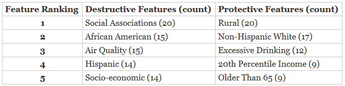

```{r setup, include=FALSE}
# stick libraries here
knitr::opts_chunk$set(echo = TRUE)
library(knitr)
```


*This should be the first section of your final project notebook. Fill out the following according to how you submitted your notebook!*

* github repository: https://github.com/TheRensselaerIDEA/COVIDMINDER/
* Your github ID: _anderd11_ 
* Github branch name of your submitted notebook: *anderd11_FINAL* 
* link to knitted, merged notebook: 
    + https://github.com/TheRensselaerIDEA/COVIDMINDER/DARL-2020-Notebooks/darl_anderd11_06Dec2020.html

# Overview & Problems Tackled

COVID-19 is rapidly infecting millions across the globe. Unfortunately, there is a higher risk as well as infection and mortality rate for individuals belonging to particular backgrounds and communities. COVIDMINDER utilizes data from County Health Rankings as well as open-source health data of those infected with COVID-19. Several statistical methods have been utilized to  develop models which measure and rank the level of impact of different features we will refer to as social determinants. A social determinant  can either be protective against COVID-19 or destructive. These metrics can help policy makers in deciding what measures can be taken to better protect vulnerable groups from facing further infection or death at disproportionate rates. 

# Data Description

For this analysis I used County Health Rankings data [1].

# Results

## Problem 1 

Understanding the importance of clear data visualizations, I noticed a few redundancies within the social determinants graphs. These figures are to highlight the different protective and destructive features for each US state while providing a picture that scales each determinant in comparison to one another. Many of the features on these graphs included raw values, as opposed to rates, which can be a bit confusing for someone that does not understand the impact that a state's population can have on the number of cases. For example, one would not have an accurate comparison if just comparing the number of COVID-19 cases in New York to that of Rhode Island, as New York has a much larger population than Rhode Island. It is better to look at averages and percentages.  

### Methods

The same methods utilized for the COVIDMINDER analysis were incorporated here [2]. To improve the State Determinants Visualizations generation, I first looked through the original graphs to see which factors were raw numbers with the same metric represented as a percentage- excluding any COVID specific attributes- and documented their names. I also added both longitude and latitude to this list. These features were then removed from both the GWAS_MRR and GWAS_ADJ_P datasets. The social determinants were ranked based upon the number of times they appeared in a state's top 15 most important social determinants. 
	
### Results
In the first portion of this study, we learned that the severity of COVID-19 is greatly worsened by socioeconomic inequality. Of the top 5 destructive COVID-19 social determinants within the United States, three of them were racial/ethnic backgrounds.



The CDC's recommendations to prevent the spread of the COVID-19 virus include avoiding close contact with others which has caused the tele-work opportunities to grow tremendously in 2020 [3]. Those from racial and ethnic minority groups are less likely to work in a field which can be operated remotely [4]. Often, these are jobs with lower income ranges and the employees of these sectors cannot afford to take off from work, which increases the amount of people this group might come into contact with each work day. Conversely, Non-Hispanic White and 20th Percentile Income were both social determinants that ranked in the top five protective features in regard to COVID-19 mortality. 

### Discussion

Based on the ranking of each social determinant, it appears that the most destructive features are in relation to race and ethnicity. Which may be a mask for income, as we have seen there tends to be a strong relationship between these factors and poverty rates. Non-Hispanic Whites are within the largest demographic of those that are able to shift to  work-from-home, therefore they have the ability to still make a living without compromising the health of themselves or others each time they 'go in to' work [5]. Taking a look at the highest ranked protective social determinants for COVID-19 further confirms this hypothesis, as we see 20th Percentile Income was the fourth most common protective feature within the United States. 

We know social associations are number of social organizations - such as a church - one participates in. Those participating are increasing the number of individuals they come into contact with, which most likely increases their exposure to the COVID-19 virus. Conversely, rural areas, which are less densely populated, shows to be the most frequently occurring protective factor for the United States. People that reside in rural areas are likely to only go into town, with a larger number of individuals, for essential reasons only - such as doctor appointments and grocery shopping.

According to our studies, having senior citizen status appeared to also be protective for a number of states. While elderly folks are much more likely to be infected and even die upon contracting the COVID-19 virus [6][7], this age demographic seems to be avoiding infection better than other groups. We suggest that this is due to the practice of quarantine and the implementation of 'senior shopping hours' by many grocery and drug stores across the nation [8]. These practices allow senior citizens to better social distance, as recommended by the CDC for lowering chances of infection.  

Despite showing up as the third highest ranking protective determinant, excessive drinking doesn't protect against the virus [9]. We will disregard this feature.

## Problem 2
 
### Methods
In order to conduct this analysis, external data visualizations were compared to help better understand the differences between COVID-19 cases in North and South Dakota. These comparisons will hopefull provide a better understanding of what increased the COVID-19 mortality for North Dakota in the month of November 2020.
	
### Results

The following graphs show how similar North and South Dakota's racial, ethnic, and economic breakdowns are. 
```{r}
include_graphics(c("SD_ND_employment_income.PNG", "SD_ND_racial_brkdwn.PNG"))
```

Below are comparisons of deaths of despair, found with the Mortality Minder application. Despite such similar population compositions, North and South Dakota have different social determinants. 
North Dakota (pictured left), South Dakota (pictured right)
```{r}
include_graphics(c("ND_mortMind_deathsDespair.PNG", "SD_mortMind_deathDespair.PNG"))
```


### Discussion
Let us assume that there was some sort of cultural gathering that caused such a severe spike in COVID-19 cases within a demographic population. One would assume that the case spike would persist for most or all states which have high concentrations of said demographic due to close contact had during the event. November 1st is All Souls' Day for Native Americans [13]. If any cultural gathering associated with such an event were the direct cause, it would be likely that there would be spikes in cases/deaths for other states with high concentrations of Native American tribes. However, this is not the trend we see. As both North and South Dakota have strikingly similar racial/ethnic populations; yet North Dakota was alone in its extreme COVID-19 mortality rate increase. 

Despite both North and South Dakota being so statistically similar, North Dakota has a massive spike in COVID-19 morbidity in late November 2020. In our previous study with the Mortality Minder application, South Dakota had American Indian/Alaskan Native as a destructive social determinant for deaths of despair and North Dakota did not have this attribute as a destructive feature [10]. One might assume that the higher concentration of  Native Americans in South Dakota counties allowed the virus to thrive only within those specific counties, almost acting as an intangible barrier. While in North Dakota, more integration between the different demographic populations caused a spread from potentially asymptomatic carriers and non-carriers at the time, which manifested in an extremely high COVID-19 mortality rate at the end of November 2020.

# Summary and COVIDMINDER Recommendations
* Much like other illness and disease, there is a disproportionate amount of infection within those that are socio-economically disadvantaged. The best thing that COVIDMINDER could do is continue analysis to see what potential causes are impacting these infection rates within specific demographics. 
* What recommendations do you have for COVIDMINDER for Data utilization, Analytics, Visualizations, User interface design, etc.
		* It would be very beneficial to funnel the COVIDMINDER study down to County level in any areas possible. Doing a case study even for one or two states that face vast disparities might open the door to finding insight that would help groups being negatively impacted.
    * Make the charts downloadable within the COVIDMINDER application (similar to Mortality Minder) - this will make it easier for decision makers to utilize COVIDMINDER as a source of information as well as allowing all others to share the knowledge of the disparities. Ideally, getting this information to the right groups could help increase the number of studies conducted and even convince gatekeepers to allowing more demographic medical data to be released!

# References

[1. COVIDMINDER Supplemental Document](https://github.com/TheRensselaerIDEA/COVIDMINDER/blob/master/social_determinants_paper/Manuscript%20and%20Supplement/Supplemental_Document__Comprehensive_Study_of_Social_Determinants_Associated_with_COVID_19_Mortality%20(1).pdf)

[2. COVIDMINDER Paper](https://github.com/TheRensselaerIDEA/COVIDMINDER/blob/master/social_determinants_paper/Manuscript%20and%20Supplement/Comprehensive_Study_of_Social_Determinants_Associated_with_COVID_19Mortality.pdf) 

[3. Pew Research Center](https://www.pewresearch.org/fact-tank/2020/05/06/telework-may-save-u-s-jobs-in-covid-19-downturn-especially-among-college-graduates/)

[4. Census](https://www.census.gov/content/dam/Census/library/visualizations/2018/demo/p60-263/figure1.pdf)

[5. Economic Policy Institute (EPI)](https://www.epi.org/blog/black-and-hispanic-workers-are-much-less-likely-to-be-able-to-work-from-home/)

[6. AARP](https://www.aarp.org/health/conditions-treatments/info-2020/coronavirus-deaths-older-adults.html)

[7. CDC](https://www.cdc.gov/coronavirus/2019-ncov/need-extra-precautions/older-adults.html)

[8. AARP](https://www.aarp.org/home-family/your-home/info-2020/coronavirus-supermarkets.html)

[9. National Institute on Alcohol Abuse and Alcoholism](https://www.niaaa.nih.gov/news-events/announcement/drinking-alcohol-does-not-prevent-or-treat-coronavirus-infection-and-may-impair-immune-function)

[10. RPI App](https://mortalityminder.idea.rpi.edu/)

[11. Census Bureau](https://data.census.gov/cedsci/profile?g=0400000US38)

[12. Census Bureau](https://data.census.gov/cedsci/profile?g=0400000US46)

[13. Legends of America](https://www.legendsofamerica.com/na-ceremonies/)

# Appendix

[Updated State Determinants Visualizations Images](https://docs.google.com/spreadsheets/d/1-Js2ouyEnWQJ4gnN3-eLq1FvClIk1Ej_-Tw5icv0dxc/edit?usp=sharing)

[Updated State Determinants Visualization Code](https://github.com/TheRensselaerIDEA/COVIDMINDER/blob/master/HACL-2020-Notebooks/Social_Determinants_Graphs/Determinant_Visualization_Simplified.Rmd)

[National Social Determinants Rankings](pro_des_story_mapping.Rmd)

[Aggregated Determinants Data](aggregated_determinants.csv)