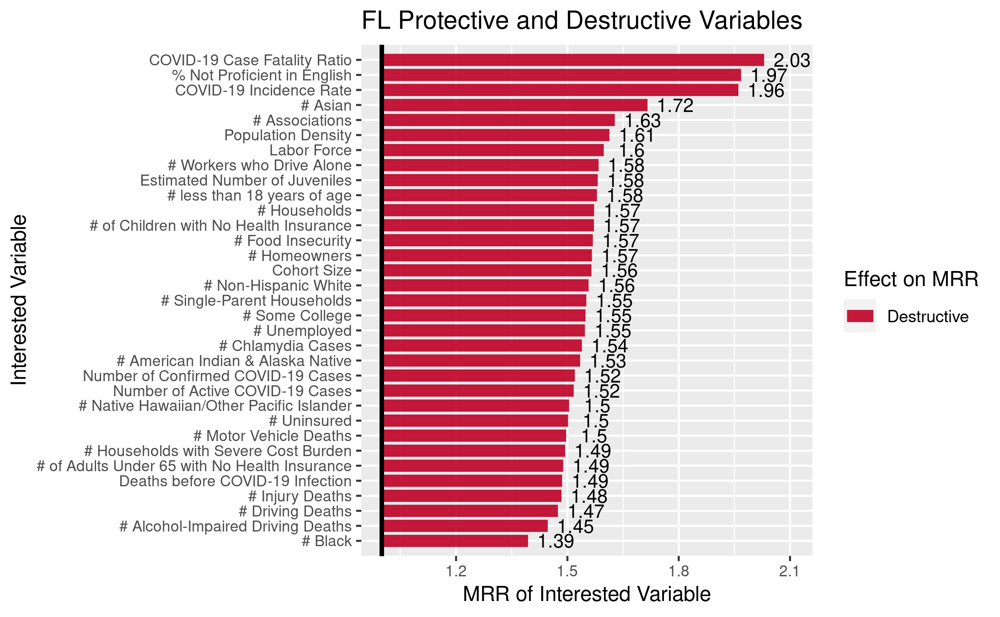
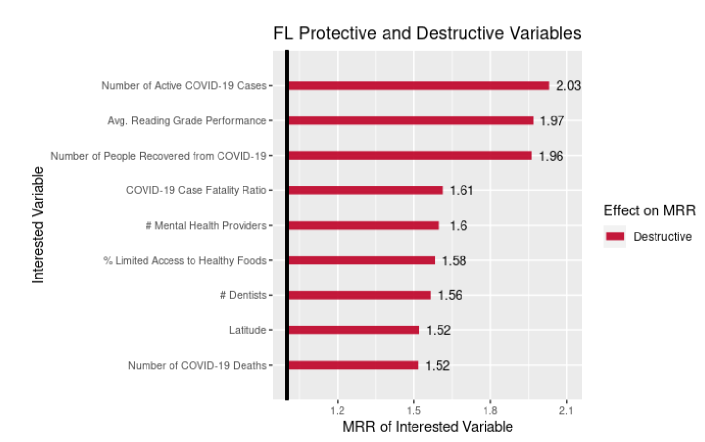

## REQUIRED: Weekly Work Summary	

* RCS ID: anderd11
* Project Name: COVIDMINDER
* Branch Name: darl_anderd11_06Nov2020


* Midterm presentation on 20 Oct, 2020: [COVIDMINDER Midterm Presentation Fall 2020](DARLF20_COVIDMINDER_Presentation1.pdf)

* Social Determinant Model Comparison: [COVIDMINDER State Determinant Viz Model Comparison Fall 2020](COVIDMINDER_Model_Comparison.pdf)

## Personal Contribution	

* It was my idea to clean up the state visualizations. It's very important for the information we find to be easily understood by any of our intended audiances. The code that I had added to remove the 'non-rate' features is shown below and lives within the load_model_output.R module for COVIDMINDER.

```{r, eval=FALSE}
## remove non-rate features (such as # of deaths)
# factors that are not rates, to be removed before analysis
non_rate <- c("Lat", "Long_", "# Alcohol-Impaired Driving Deaths", "# Driving Deaths", "# Chlamydia Cases", "# Chlamydia Cases", "# Uninsured", "# Primary Care Physicians", "# Dentists", "# Mental Health Providers", "# Some College", "# Unemployed", "# Single-Parent Households", "# Households", "# Associations", "# Injury Deaths", "# Workers who Drive Alone", "pre_covid_deaths", "child_deaths", "infant_deaths", "# HIV Cases", "# Food Insecure", "# Limited Access", "# Drug Overdose Deaths", "# Motor Vehicle Deaths", "# Uninsured_1", "# Uninsured_2", "# Firearm Fatalities", "# Homeowners", "# Households with Severe Cost Burden", "# less than 18 years of age", "# Black", "# American Indian & Alaska Native", "# Asian", "# Native Hawaiian/Other Pacific Islander", "# Hispanic", "# Non-Hispanic White", "# Not Proficient in English", "# Rural")

GWAS_MRR <- GWAS_MRR[ !(row.names(GWAS_MRR) %in% non_rate), ]
#View(GWAS_MRR)

GWAS_ADJ_P <- GWAS_ADJ_P[ !(row.names(GWAS_ADJ_P) %in% non_rate), ]
```


My teammate and I worked to compare the graphs which resulted from the two models being run to find the social determinants of COVID. This involved me running the newest, optimized visualization code (which uses the negative binomial method) for a few selected states - Ohio, Florida, and California.

## Discussion of Primary Findings 	

* Discuss primary findings: 

    * My goal for the semester was to work to improve the State Determinants Visualizations and analysis for the COVIDMINDER project. These are attributes of individuals and populations which are potentially contributing to the prevalence of COVID-19 within each group. Protective factors are suspected to decrease the chance that one contracts COVID-19; and destructive factors the converse. Upon first looking at the graphs generated, there are quite a few features/attributes which are either redundant because they're represented as both a number and a percentage, or the feature is not necessary for analyzing the correlations between COVID-19 cases and socio-economic factors. The data for COVIDMINDER is presented in relation to the various states within the USA, and so latitude and longitude would both be features worth removing. Additionally, as there were two models being used to evaluate the level of protectiveness or destructiveness for various social-economic factors, I wanted to see which model was best at providing an overview of what might make different subpopulations more vulnerable to the COVID-19 virus. Myself and a fellow classmate have begun comparing our models (negative binomial vs [XYZ]).
    * To improve the State Determinants Visualizations generation, I first looked through the original graphs to see which factors were raw numbers with the same metric represented as a percentage (excluding any COVID specific attributes) and documented their names. I also added both longitude and latitude to this list. I then created a vector containing each of these feature names ('non-rate') and implemented a few lines of code which remove these features from both the GWAS_MRR and GWAS_ADJ_P dataframes. Another teammate worked then to shorten the visualization code, as it contained thousands of lines of code repeating the same commands. 
    * After the optimization of our visualization code, we were able to identify more accurate features for several states. For example: Florida had dozens of destructive features in its original graph. After improving our code, we were able to pinpoint 9 of the most pressing destructive features. We have also determined that the model my teammate worked on is best for our project objective.
	
* 


* 
