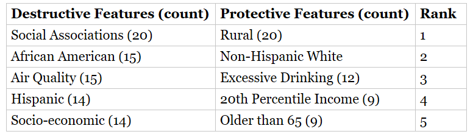
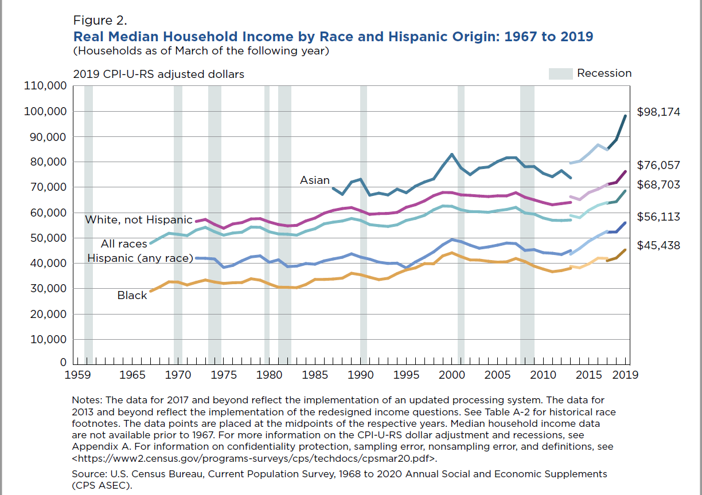

## REQUIRED: Weekly Work Summary	

* RCS ID: anderd11
* Project Name: COVIDMINDER
* Branch Name: darl_anderd11_20Nov2020


* Midterm presentation on 20 Oct, 2020: [COVIDMINDER Midterm Presentation Fall 2020](DARLF20_COVIDMINDER_Presentation1.pdf)

* Social Determinant Model Comparison: [COVIDMINDER State Determinant Viz Model Comparison Fall 2020](COVIDMINDER_Model_Comparison.pdf)

* This week, the COVIDMINDER group decided to offically go with the model used in the analysis done by Honxi Mou with Kendall plot visualizations. We aggregated this data to take a closer look at the social determinants. This data can be found in the COVIDMINDER github, and is called 'aggregated_determinants.csv' and shows the average number of times each determinant - both destructive and protective - appears in the top determinants for the states, the respective mean correlation values for these features, the feature ranking, and the states for which the determinant appeared during the orignal social determinant analysis.

## Personal Contribution	

* Since I have worked previously with building the story for the impact of socio-economic factors on health related issues, I have been tasked with developing the story for our COVIDMINDER project. This week, I searched for existing research highlighting correlations between some of our determinants and complications that come with COVID-19 cases (i.e. poor air quality and its adverse impact on those with compromised respiratory systems - like asthmatic individuals).

* I utilized the **aggregated_determinants.csv** data set, created by Hongxi Mou, to calculate a few trends in the social determinant impact scores to help decide which determinants would provide the most useful information in helping citizens protect themselves a bit better as the number of COVID-19 cases surges to record-high levels again this season.

* Here is the code snippet I used to rank the determinants to use as we develop a data-driven story

```{r, eval=FALSE}
# load aggregated social determinants attributes data
ag_Det <- read_csv('aggregated_determinants.csv')

# view rank of destructive determinants from most apparent to least
des_rank <- ag_Det[c("chr_code","des_count")]

des_rank <- des_rank[order(-des_rank$des_count),]
View(des_rank)

pro_rank <- ag_Det[c("chr_code", "pro_count")]

pro_rank <- pro_rank[order(-pro_rank$pro_count),]
View(pro_rank)
```


* These are the top determinants and their ranking based on the aggregated_determinants dataset
 

## Discussion of Primary Findings 	

*	Social Distancing support

    	* We know social associations are number of social organizations - such as a church - one participates in. Those participating are increasing the number of individuals they come into contact with, which most likely increases their exposure to the COVID-19 virus. Conversely, rural areas, which are less densely populated, shows to be the most frequently occurring protective factor for the United States. People that reside in rural areas are likely to only go into town, with a larger number of individuals, for essential reasons only - such as doctor appointments and grocery shopping.
    	 * Many companies shifted to work-from-home models to protect employees. By taking a look at some numbers from the Bureau of Labor Statistics, we see a bit of a correlation with our rankings above. Non-Hispanic Whites are within the largest demographic of those that are able to shift to  work-from-home, therefore they have the ability to still make a living without compromising the health of themselves or others each time they 'go in to' work.

  
  