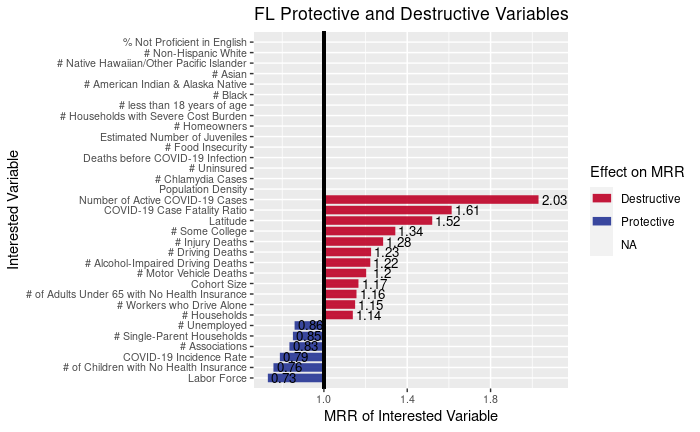

## REQUIRED: Weekly Work Summary	

* RCS ID: anderd11
* Project Name: COVIDMINDER
* Branch Name: darl_anderd11_23Oct2020

* Midterm presentation on 20 Oct, 2020: [COVIDMINDER Midterm Presentation Fall 2020](DARLF20_COVIDMINDER_Presentation1.pdf)

## Personal Contribution	

* developed R code to remove non-rated attributes from State Determinant Visualizations
* debgging (with much needed assistance) the newest version of State Determinant Visualization code to determine where the non-rate factors still exist that are causing them to still appear in the charts

## Discussion of Primary Findings 	

* Discuss primary findings: 

    * lots of changes to be made to module(s) and debugging that needs to be done 
    * removed the non-rate values from the original data frame, but they are still showing up in the visualizations (debugging in process with help of Hongxi and Karen)
    * process
          * create vector containing names of each attribute (which is a row in the GWAS_MRR/GWAS_ADJ_P data frames)
          * run single-line command to extract/remove each row with name in removal vector ('non-rate')
          * checked number of rows prior to removal (222 rows)
          * checked number of rows **after** removal to ensure it ran (187 rows)
    * despite confirming that the rows in question were removed, I ran the remaining Social Determinants Visualization code and some of the factors still appeared
          * this may be due to the extraction of data from different sources but I am unsure, which is why I requested assistance from Hongxi and Karen
	
* 

* 