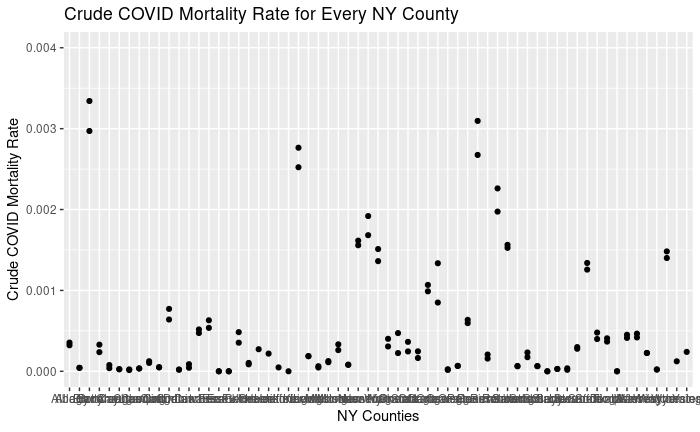
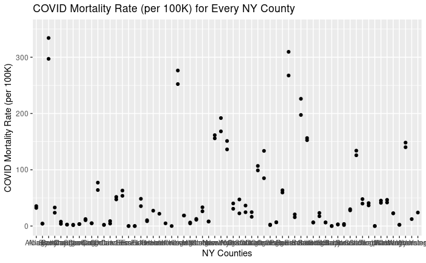
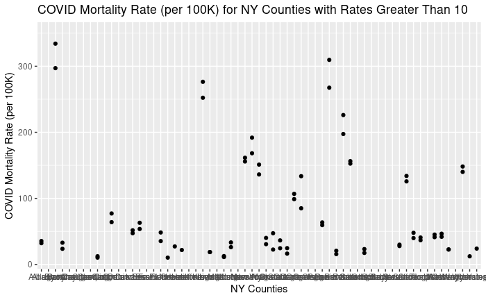
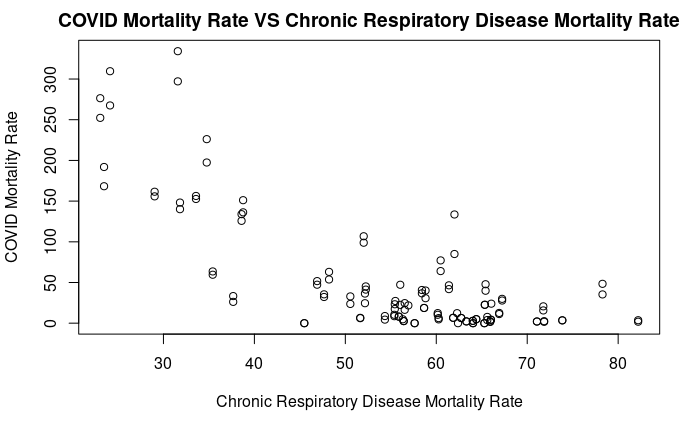
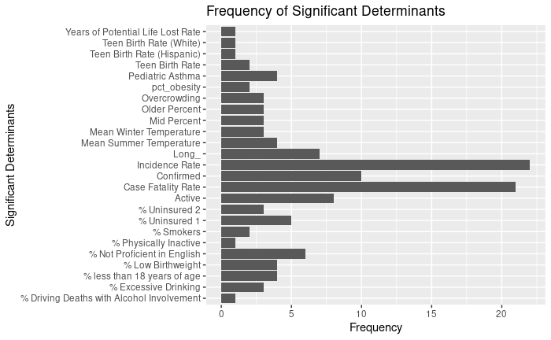
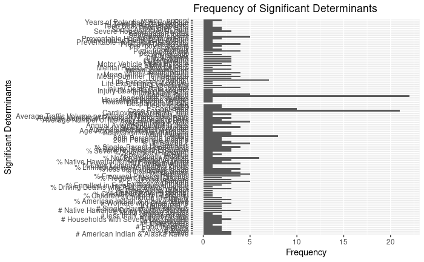
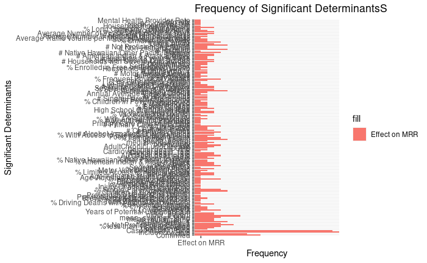
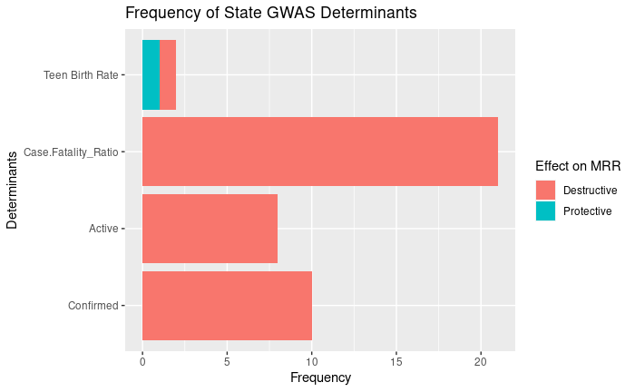

*I apologize for the late submission. I did not have power since Tuesday afternoon. I still do not have power and am spending a night at a place with internet. Power is expected to come back on Sunday.* 

## Weekly Work Summary	
* RCS ID: ahns3
* Project Name: COVIDMINDER
* Summary of work since last week: 

    * Edited correlation plot of COVID mortality rates for all of the New York counties for better readability (title, axis labels)
    * Edited correlation plot of the COVID mortality rate and chronic respiratory mortality rate of NY counties for better readability (title, axis labels, scale for COVID mortality rate)
    * Created bar graph that shows the number of times each determinant appears as significant from the state GWAS
    * Creating stacked bar graph that shows the number of times each state GWAS determinant as protective or destructive
    * Beginning a rough draft of the blog post

* Summary of github commits: 

    * Branch Name: hacl-ahns3
    * Browsable Links to all external files on github
      * ahns3-Week3_Graphs.Rmd
        * https://htmlpreview.github.io/?https://raw.githubusercontent.com/TheRensselaerIDEA/COVIDMINDER/hacl-ahns3/HACL-2020-Notebooks/ahns3-GraphingNotebooks/ahns3-Week3_Graphs.nb.html 
      * Determinants_Graphing.Rmd
        * https://htmlpreview.github.io/?https://raw.githubusercontent.com/TheRensselaerIDEA/COVIDMINDER/hacl-ahns3/HACL-2020-Notebooks/ahns3-GraphingNotebooks/Determinants_Graphing.nb.html  
      * Determinants_Stacked_Bar.Rmd
        * https://htmlpreview.github.io/?https://raw.githubusercontent.com/TheRensselaerIDEA/COVIDMINDER/hacl-ahns3/HACL-2020-Notebooks/ahns3-GraphingNotebooks/Determinants_Stacked_Bar.nb.html 
      * ahns3ProtoNotebook.Rmd
        * https://raw.githubusercontent.com/TheRensselaerIDEA/COVIDMINDER/hacl-ahns3/HACL-2020-Notebooks/ahns3-GraphingNotebooks/ahns3ProtoNotebook.Rmd
      * copy of play code.R
        * https://raw.githubusercontent.com/TheRensselaerIDEA/COVIDMINDER/hacl-ahns3/HACL-2020-Notebooks/ahns3-GraphingNotebooks/copy%20of%20play%20code.R 
      
    
* List of presentations,  papers, or other outputs:

    * N/A
    
* List of references:
    * N/A

* Indicate any use of group shared code base:
    * Repo and branch: https://github.com/TheRensselaerIDEA/COVID-Notebooks/tree/Social_Determinants
    * Directory and file: 'ProtoNotebook.html'
    https://htmlpreview.github.io/?https://raw.githubusercontent.com/TheRensselaerIDEA/COVID-Notebooks/Social_Determinants/Notebooks/ProtoNotebook.html,   https://raw.githubusercontent.com/TheRensselaerIDEA/COVID-Notebooks/Social_Determinants/Notebooks/ProtoNotebook.Rmd

* Indicate which parts of your described work were done by you or as part of joint efforts:
    * ProtoNotebook.Rmd is the work of Tiburon Benavides.
    * Determinants_Graphing.Rmd and Determinants_Stacked_Bar.Rmd include and is based on the code from ProtoNotebook, but the analysis is my work.

## Personal Contribution
*Notebooks contain comments*

* Code in ahns3-Week_Graphs.Rmd: https://raw.githubusercontent.com/TheRensselaerIDEA/COVIDMINDER/hacl-ahns3/HACL-2020-Notebooks/ahns3-GraphingNotebooks/ahns3-Week3_Graphs.Rmd
  * Plot of COVID Mortality Rates for all of the New York Counties:
    * This code was used to find the COVID mortality rate for each NY county.
    * Code:
      * covid_NY_counties_deaths <- read.csv(file.choose())
      * NY_populations <- read.csv("NY_population.csv")
      * myfulldata = merge(covid_NY_counties_deaths , NY_populations, by.x="county", by.y="County")
      * mortality_rate_sa = myfulldata$deaths/myfulldata$Population
      * myfulldata$mortality_rate <- c(mortality_rate_sa)
      * ggplot(data=myfulldata, aes(x=county, y=mortality_rate))+geom_point()+  ylim(c(0, .004))+xlab("NY Counties")+ ylab ("Crude COVID Mortality Rate")+ ggtitle("Crude COVID Mortality Rate for Every NY County")
      * stadper100000 = mortality_rate_sa *100000
      * myfulldata$mortality_per_100000 <- c(stadper100000)
      * ggplot(data=myfulldata, aes(x=county, y=mortality_per_100000))+geom_point()+  ylim(c(0, 350))+xlab("NY Counties")+ ylab ("COVID Mortality Rate (per 100K)")+ ggtitle("COVID Mortality Rate (per 100K) for Every NY County")
      *ggplot(data=myfulldata, aes(x=county, y=mortality_per_100000))+geom_point()+  ylim(c(10, 350))+xlab("NY Counties")+ ylab ("COVID Mortality Rate (per 100K)")+ ggtitle("COVID Mortality Rate (per 100K) for NY Counties with Rates Greater Than 10")

  * Correlation Plot of COVID Mortality Rate and Chronic Repsiratory Disease Mortality Rate for each NY County
    * This code was used to compare the COVID mortality rate and chronic repsiratory disease mortality rate for each NY county.
    * Code:
      * chronicrespiratorydiseases_counties 
      * myfulldataresp = merge(myfulldata , chronicrespiratorydiseases_counties, by="FIPS")
      * cor.test(myfulldataresp$mortality_per_100000,myfulldataresp$MortalityRate2014)
      * plot(myfulldataresp$MortalityRate2014, myfulldataresp$mortality_per_100000, xlab="Chronic Respiratory Disease Mortality Rate", ylab="COVID Mortality Rate", main="COVID Mortality Rate VS Chronic Respiratory Disease Mortality Rate")
      * lm(myfulldataresp$mortality_per_100000~myfulldataresp$MortalityRate2014)
* Code in Determinants_Graphing.Rmd: https://raw.githubusercontent.com/TheRensselaerIDEA/COVIDMINDER/hacl-ahns3/HACL-2020-Notebooks/ahns3-GraphingNotebooks/Determinants_Graphing.Rmd 
  * This code was used to find number of occurrences of each significant determinant in the state GWAS.
  * Code:
    * prtdescombined = rbind(dataAL , dataAR,dataAZ,dataCA, dataCO, dataFL, dataGA, dataIA, dataID,dataIL,dataIN,dataKS, dataKY, dataLA, dataMI, dataMN, dataMO, dataMS, dataMT, dataNC, dataND, dataNE, dataNJ, dataNM, dataNY, dataOH,dataOK,dataOR,dataPA,dataSC,dataSD, dataTN,dataTX,dataVA,dataWA,dataWI,dataWV)
    * count_confirmed<- ldply(prtdescombined,function(c) sum(c=="Confirmed"))
      * 24 more lines similar to one above
    * significantdeterminants <- data.frame (determinants  = c("Confirmed", "Active", "Case Fatality Rate","Teen Birth Rate","Overcrowding","% less than 18 years of age","% Not Proficient in English","Pediatric Asthma","% Uninsured 1","% Uninsured 2","Mean Winter Temperature","Mean Summer Temperature","Long_","Older Percent","Mid Percent","Years of Potential Life Lost Rate","% Low Birthweight","% Smokers","pct_obesity","% Physically Inactive","% Excessive Drinking","% Driving Deaths with Alcohol Involvement","Teen Birth Rate (Hispanic)","Teen Birth Rate (White)","Incidence Rate"),
                                       frequency = c("10", "8", "21", "2", "3", "4", "6", "4", "5","3","3","4","7","3","3","1","4","2","2","1","3","1","1","1","22")
                                       #prtordes=  
                                         )
    * significantdeterminants$frequency <- as.numeric(as.character(significantdeterminants$frequency))
    * p <- ggplot(significantdeterminants, aes(x=determinants, y=frequency)) + 
  geom_bar(stat = "identity") +
  xlab("Significant Determinants") + ylab("Frequency") + ggtitle("Frequency of Significant Determinants")
    * p + coord_flip()
* Code in Determinants_Stacked_Bar.Rmd: https://raw.githubusercontent.com/TheRensselaerIDEA/COVIDMINDER/hacl-ahns3/HACL-2020-Notebooks/ahns3-GraphingNotebooks/Determinants_Stacked_Bar.Rmd
  * This code was used for a more time efficient analysis of all of the state GWAS and to create a new data frame to allow the separation of protective and destructive occurrences.
  * Code:
    * detconfirmed = subset(prtdescombined, y == "Confirmed")
    * count_confirmed<- ldply(detconfirmed,function(c) sum(c=="Confirmed"))
    * freqconfirmed = count_confirmed[-c(2, 3),]
    * freqconfirmed$Determinants = "Confirmed"
    * prtconfirmed = ldply(detconfirmed, function(c) sum(c == "Protective"))
    * freqprtconfirmed = prtconfirmed[-c(1,2),]
    * freqconfirmed$Protective = freqprtconfirmed
    * desconfirmed = ldply(detconfirmed, function(c) sum(c == "Destructive")) 
    * freqdesconfirmed = desconfirmed[-c(1,2),]
    * freqconfirmed$Destructive = freqdesconfirmed
      * repeat this code for each variable
    * sigdeterminants <- bind_rows(freqconfirmed, freqactive, freqcase.fatality, freqteenbirth, freqovercrowding, freqlessthan18, freqnotproficientinenglish, freqpediatricasthma, frequninsured1, frequninsured2, freqmeanwintertemp, freqmeansummertemp, freqlong, freqolderpecent, freqmidpecent, freqyearspotentiallifelostrate, freqlowbirthweight, freqsmokers, freqpct_obesity, freqphysicallyinactive, freqexcessivedrinking, freqdrivingalcohol, freqteenbirthhispanic, freqteenbirthwhite, freqincidencerate, freqpreventablehospital, freqpreventablehospitalhispanic, freqpreventablehospitalwhite, freqscreenedhispanic, freqchildrenpoverty, freqincomeratio, freqsingleparent, freqinjurydeathrate, freqinjurydeathratehispanic, freqinjurydeathratewhite, freqinadequatefacilities, freqdrivealonehispanic,freqdrivealonewhite, freqprecoviddeathrate,freqageadjustedhispanic,freqageadjustedwhite, freqpct_diabetes, freqfoodinsecure, freqlimitedhealthyfood, freqmotormortality, freqinsufficientsleep, freqsegregationindex, freqhomeowners, freqpct_age65,freqblack,freqindianalaska, freqhawaiian, freqnonhispanicwhite, freqadultasthma, freqhouseholdincomeblack, freqmean_summer_rm, freqpct_owner_occ, freqpoverty,freqmentalproviderrate, frequnhealthydays, freqdrivealonework,freq20percentileincome, freqlongcommutedrivealone,freqsocialassociationrate,freqtrafficvolumepermeter,freqmentalunhealthydays,freqmentaldistressfrequent,freqwhitechildpoverty,freqmean_pm25,freqLungCancer,freqfemale,freqhispanic, freqnolessthan18,freqnoblack,freqnoindianalaska,freqnoasian,freqnohawaiian,freqnohomeowners,freqnohouseholdwithseverecostburden,freqseverehousingcostburden, freqDenominator,freqSegregation_index,freqenrolledfreelunch,freqhouseholdincomewhite,freqnouninsured2, freqnouninsured1,freqmotorvehicledeaths,freqnolimitedaccess,freqnofoodinsecure,freqnohivecases,freqphysicaldistressfrequent,freqpre_covid_deaths,freqlifeexpwhite,freqlifeexphispanic,freqlifeexp,freqRural,freqAll.Cause.death_rate,freqAssault.death_rate,freqCancer.death_rate,freqCardiovascular.death_rate,freqDespair.death_rate,freqCOPD,freqAdultChronicLungDisease,freqnoworkersdrivealone,freqjustseverehousingcostburden,freqeverehousingproblems,freqaveragedailypm2.5,freqnoinjurydeaths,freqaverageviolentcrimes,freqnoassociations,freqnohouseholds,freqnosingleparenthouseholds,freq80percentileincome,freqchildrenpovertyhispanic, freqLat,freqpopdensity,freqmedianhousevalue,freqyoung_pecent,freqprime_pecent)
    * p <- ggplot(sigdeterminants, aes(x=Determinants, y=V1)) + 
  ggtitle("Frequency of Significant Determinants")+
  xlab("Significant Determinants") +
  ylab("Frequency") +
  geom_bar(stat = "identity")
    * p + coord_flip()
    * ggplot(data=prtdescombined, aes(x=y, y='V1', fill='Effect on MRR')) +
  ggtitle("Frequency of Significant DeterminantsS")+
  xlab("Significant Determinants")+
  ylab("Frequency") +
  geom_bar(stat = "identity")+coord_flip()

## Discussion of Primary Findings 	

* Discuss primary findings: 
    * After looking back on my past work, I realized that I had no idea what my graphs were representing. I gave each graph below a new title and axis labels to clearly convey my results.
```{r}
#Edited Graphs of COVID Mortality Rate




```

  * Using the ProtoNotebook, I extended on it in order to find the number of times each determinant appeared from the state GWAS. I used this code to find the significant determinants for each state and then combined the information into a single data frame. I tried one approach in the Determinants_Graphing.Rmd, where I counted the appearance of each determinant. Then, I inputted the value manually into a data frame. This was an inefficient way to do this, and it did not yield me the information I needed. I changed my approach to the one in Determinants_Stacked_Bar.Rmd so that I will be able to see the frequency of positive and destructive occurrences in the data frame. 
  * The top two highest significant determinants are Incidence Rate (of COVID) and Case Fatality Ratio. Both of them show up as destructive variables, meaning that they do not help prevent COVID infection/mortality.
  
```{r}
#Graphs of Social Determinants Frequency in State GWAS
#Graph from Determinants_Graphing.Rmd

#Graph from Determinants_Stacked_Bar.Rmd

```
      
  * I was able to input all of the determinants, but the color is not representing the protective and destructive occurrences. My next focus will be to fix this, be able to graph the top 10 significant determinants, and cross check the top 10 to the national GWAS.
```{r}
#Stacked Bar Graph of Social Determinants Frequency of Protective and Destructive Occurrences

```

## Drafting your DAR/HACL Blog Post
    * Who: student researchers
    * What: looked at all of significant determinants from state GWAS
    * Where: RPI and data from all states
    * When: July/August
    * Why: combine all state GWAS to compare to national GWAS
    * How: stacked bar graph

Student researchers of RPI during the months of July and August looked at the significant determinants for all 50 states. A stacked bar graph was used to visualize this data and find out the top 10 significant determinants whether it is destructive or protective.

```{r}

```
Figure 1: Sample Stacked Bar Graph of Significant Determinants from State GWAS

    * What did you want to know?
      * top 10 significant determinants and if they show up in the national GWAS
    * How did you go about finding it?
      * code in Determinants_Graphing.Rmd and Determinants_Stacked_Bar.Rmd
      * found all state GWAS and its significant determinants and combined them into one data frame
      * made a subset from data frame for each variable
      * counted frequency of determinant appearance from each variable subset
      * combined all subsets
      * plotted stacked bar graph of combined subset data frame
    * What did you find?
      * Incidence rate and case fatality ratio are the two that are noticeably the most occurring determinants
 


