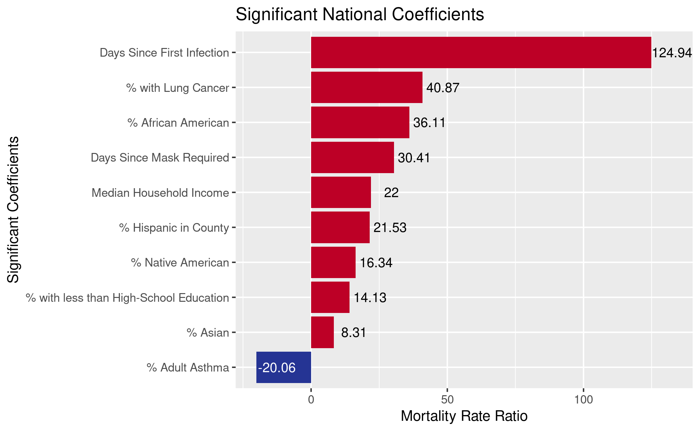
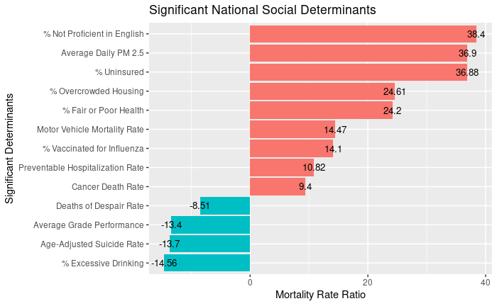

## Instructions (DELETE BEFORE SUBMISSION)

4. You MUST include links to other important resources (knitted HTMl files, Shiny apps). See the guide below for help.

5. Commit the source (`.Rmd`) and knitted (`.html`) versions of your notebook and push to github

6. **Submit a pull request.** Please notify Dr. Erickson if you don't see your notebook merged within one day. 

7. **DO NOT MERGE YOUR PULL REQUESTS YOURSELF!!**

### Guide to linking to external resources (DELETE BEFORE SUBMISSION)

1. How to link to knitted notebooks (ie HTML) files

* For files merged with the master on github, it's possible to provide a direct link in your notebook using the following pattern:

    * Preface: `https://htmlpreview.github.io/? `
    * Repo and branch: `https://raw.githubusercontent.com/TheRensselaerIDEA/COVID-Twitter/master/ `
    * Directory and file: `HACL-2020-Notebooks/status_notebook_template.html'

* Example for projects on the public github (COVIDMINDER, COVID Twitter):

https://htmlpreview.github.io/?https://raw.githubusercontent.com/TheRensselaerIDEA/COVID-Twitter/master/HACL-2020-Notebooks/status_notebook_template.html 

## Work Summary	

* RCS ID: ahns3
* Project Name: COVIDMINDER
* Summary of Work

    * worked on and finished blog post
    * made a stacked bar graph that shows the top 12 state GWAS determinant and frequency of  being protective or destructive
    * found and plotted correlation between COVID-19 mortality rate and suicide rate
    * found and plotted correlation between COVID-19 mortality rate and excessive drinking
    * made graph of the national significant coefficients and determinants
    
* Summary of github contributions 

    * 
    * include browsable links to all external files on github
    * 
    
* List of presentations,  papers, or other outputs

    * Include browsable links!
    
* List of references (if necessary) 
* Indicate any use of group shared code base
* Indicate which parts of your described work were done by you or as part of joint efforts

## Personal Contributions

* Clearly defined, unique contribution(s) done by you: code, ideas, writing...

## Discussion of Primary Findings 	

* Discuss primary findings: 

    * What did you want to know? 
    * How did you go about finding it? 
    * What did you find?
	
* **Required:** Provide illustrating figures and/or tables
```{r}


```

    * If your figures are "live," either include source code embedded in notebook or provide github location for their source scripts

## Your Final DAR/HACL Blog Post

*Use this space to include a draft of your end-of-term Data INCITE Blog Post. As discussed in class, the "specs" for this post are...*

* 400-600 words in length
* Clear statement of your **lede** --- the first paragraph of any news story, containing the "Five W’s and H:" who, what, where, when, why, and how.

    * Who: Who is the post about?
    * What: What happened in the post?
    * Where: Where did the work you’re writing about occur?
    * When: When did it occur?
    * Why: Why did this happen?
    * How: How did this happen?

* A screen shot or image that best illustrates your post
* Answer these three questions:

    * What did you want to know?
    * How did you go about finding it?
    * What did you find?
    
