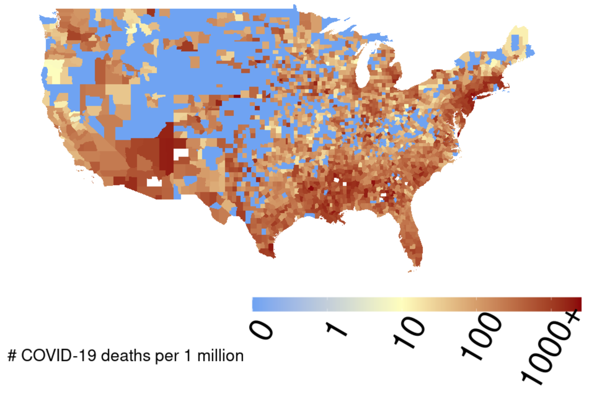

## Work Summary	

**NOTE:** Follow an outline format; use bullets to express individual points. 

* RCS ID: reschc
* Project Name: COVIDMINDER
* Summary of Work

    * A lot of my summer has been focused around learning different areas of R that I hadn't had any experience with. My previous knowledge centered more around statistical anaylsis and small scale scripts. I had to spend a reasonable amount of time learning the structure of COVIDMINDER as well as how to create or modify visualizations that would be to the standard of the work within the project.
    * 
    * Focus on the big picture by be sure to highlight pointsof interest
    
* Summary of github contributions 

    * https://github.com/TheRensselaerIDEA/COVID-Notebooks/tree/hacl-reschc/Summer_2020_notebooks/reschc
    
* List of presentations,  papers, or other outputs

## Personal Contributions

* I made a visualization for Dr. Bennett (this is outside of the core COVIDMINDER app) for a talk she gave to Optum Labs. The visualization utilizes Johns Hopkins COVID data and 2017 census county maps to show mortality rates per million people for each county in the country. 
* I am in the process of replacing the diabetes visualization on the national report card tab of COVIDMINDER. There isn't anything on github yet but there should be in the coming days. 
*Work on the integrating of social determinants into the greater covidminder application is currently under the branch reschc-determinants. In this branch, there is a section that supports PNGs for social determinants visualizations, but I am working on adding support for live visualizations to both national and state report cards. Social determinants as a team is also currently working on the social_determinants branch of covid-notebooks, and I am currently helping them prepare to merge their work with the master branch of the repo.
*Hongxi made me aware of some visualizations that could be lifted from mortality minder and applied to the social determinants section of the covidminder application. While I am pessimistic that I'll be able to integrate these visualizations and their underlying data processing into the covidminder application before the end of this week, I plan to add the code to make the visualizations into the covidminder repo so that future developers can make more progress.

## Discussion of Primary Findings 	

* Discuss primary findings: 

    * Dr. Bennett and I were interested in looking at and comparing cumulative mortality rates for COVID for the entire country.
    * The way we went about finding it was to create a visualization fueled by up to date data. I've described this visualization above. 
    * I found that for the most part, rural areas in the midwest either have much lower mortality rates because of the lower incidence rates that they experience, or they have a more difficult time gathering accurate reporting. The significant spread of the virus into the south has in turn lead to an increase in mortality rate that brings much of the region in line with the north east. It will be interesting to follow along with this as we move into the fall.
	
* **Required:** Provide illustrating figures and/or tables

```{r}
 
```

## Your Final DAR/HACL Blog Post

*Use this space to include a draft of your end-of-term Data INCITE Blog Post. As discussed in class, the "specs" for this post are...*

The direction in which COVID has moved through the United States has been an important topic of discussion since March. A topic that closely follows this and has a massive impact on society is the death rate from COVID. I wanted to take a look at comparing cumulative death rates for the United States as a whole, especially at a county level where we can better infer what the potential variables that could be driving mortality rates. I went about this by bringing in COVID data separated by county from Johns Hopkins and using a Spatial Polygon Data Frame provided by 2017 Census Bureau files that can be joined with the aforementioned COVID data. This enables us to view mortality rates per 1 million people for each county on a map. The visualization that I have focused on uses the most recent data but it can be edited to focus on past rates. The map shows us that severe death rates are mostly clustered around the coasts, but the interesting developments are centered around the south and the midwest. Lots of the COVID coverage has been focused on the North East, but recent spikes in incidence levels for the southern parts of the United States seem to now be translating into mortality rates. Reasons that this has happened are plentiful. Climbing incidence rates can be explained by stay at home orders being lifted extremely early, as well as a larger proportion of sothern populations being more averse to proper anti-virus measures (masks, social distancing). Once these incidence rates started to climb, existing potential comorbidites that are more prevalent in the south, such as diabetes and advanced age, became a significant driving force towards the climbing mortality rates that we now see. An interesting point to take from the visualization is that while some of these comorbidities are significantly present in the midwest, areas like the plains do not boast significant mortality rates. This can be the product of a couple things. The ruralness of the midwest could have either helped keep incidence rates low, or it could've suppressed reporting. 

```{r}
 
```

