## Work Summary

* RCS ID: ahns3
* Project Name: COVIDMINDER
* Summary of Work

    * created notebook that produces live images of national determinants and each state determinant
    * created visualization of the most occurring state GWAS determinants and its frequency of being protective or destructive
    * did correlation tests on some significant determinants vs COVID-19 mortality rate
    * wrote a blog post
    
* Summary of github contributions 

    * branch: hacl-ahns3
    * ahns3-State_GWAS_Working_Determinants_Graphing.Rmd
        * code for visualizing significant determinants
        * https://htmlpreview.github.io/?https://raw.githubusercontent.com/TheRensselaerIDEA/COVIDMINDER/hacl-ahns3/HACL-2020-Notebooks/ahns3-GraphingNotebooks/ahns3-State_GWAS_Working_Determinants_Graphing.nb.html
    * ahns3ProtoNotebook.Rmd
        * code for live images of state and national FWAS
        * https://htmlpreview.github.io/?https://raw.githubusercontent.com/TheRensselaerIDEA/COVIDMINDER/hacl-ahns3/HACL-2020-Notebooks/ahns3-GraphingNotebooks/state_pngs/ahns3ProtoNotebook.Rmd
    * ahns3-covid_vs_variable.Rmd
        * code for correlation graphs
        * https://htmlpreview.github.io/?https://raw.githubusercontent.com/TheRensselaerIDEA/COVIDMINDER/hacl-ahns3/HACL-2020-Notebooks/ahns3-GraphingNotebooks/ahns3-covid_vs_variable.nb.html 


* List of presentations,  papers, or other outputs

    * https://docs.google.com/presentation/d/1uDTZuiYu8iCo9XKrOEfJZt663kdt7r4Ox3WHPdE6vs8/edit?usp=sharing
    
* List of references 
    * https://www.overleaf.com/project/5f16ea6f21ba9e00018198f8 (research paper that COVIDMINDER wrote)
    
* Indicate any use of group shared code base
    * ProtoNotebook
    * https://htmlpreview.github.io/?https://raw.githubusercontent.com/TheRensselaerIDEA/COVID-Notebooks/Social_Determinants/Notebooks/ProtoNotebook.html

* Indicate which parts of your described work were done by you or as part of joint efforts
    * parts of the ProtoNotebooks were used in the ahns3ProtoNotebook and are indicated

## Personal Contributions

From ahns3ProtoNotebook.Rmd

* made live visualization of significant determinants in each state
* CODE: state determinants (Alabama is given as an example)
```{r}
#all made into comments because chunk will not knit but end result is this
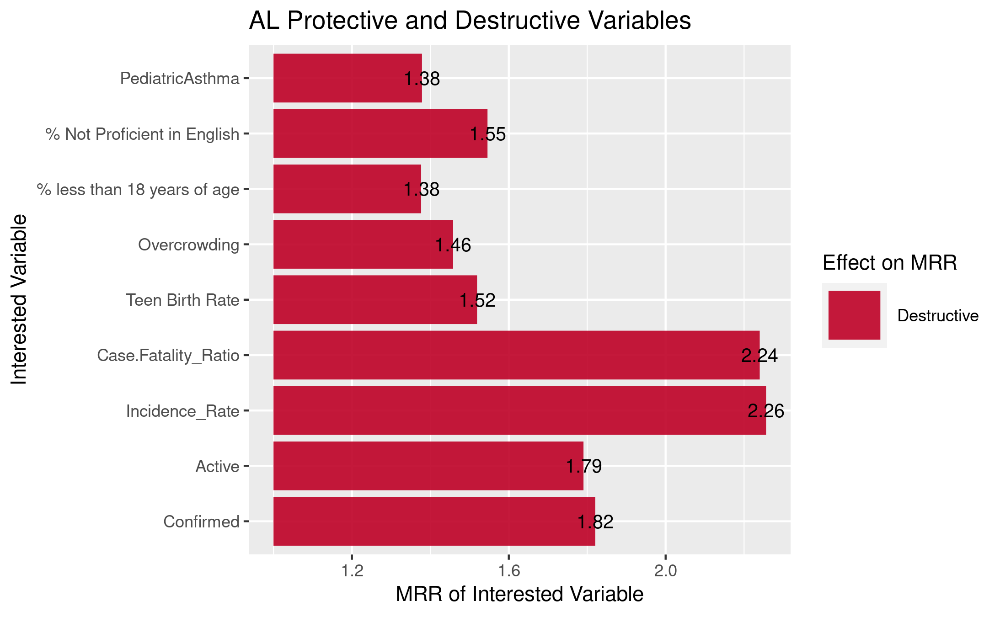

# #from ProtoNotebook
#   # Libraries
#   library(ggplot2)
# # Create data
# 
# for (state in colnames(GWAS_MRR)) {
# #select state  
#   state = "AL"
#   state
# #sorts determinants as protective or destructive
#    prt <- c(NA)
#     des <- c(NA)
#     for (itr in 1:length(GWAS_ADJ_P[[state]])) {
#       if (is.na(GWAS_ADJ_P[[state]][itr]) == FALSE  && GWAS_ADJ_P[[state]][itr] < 0.05 ) {
#         if (is.na(GWAS_MRR[[state]][itr]) == FALSE  &&  GWAS_MRR[[state]][itr]  >= 1.0 ) {
#           des <- c(des, itr)
#         } else {
#           prt <- c(prt, itr)
#         }
#       }
#     }
#     #prt[2:length(prt)]
#     vals  <- c(NA)
#     names <- c(NA)
#     if (length(prt) > 1){
#       names <- colnames(model_input)[prt[2:length(prt)]]
#       vals <- GWAS_MRR[[state]][prt[2:length(prt)]]
#     }
#     if (length(des) > 1){
#       names <- c(names, colnames(model_input)[des[2:length(des)]])
#       vals <- c(vals, GWAS_MRR[[state]][des[2:length(des)]])
#     }
#     
#     if (length(names) == 1) {
#       print("Insufficient data or no protective or destructive variables in this state.")
#       next
#     }
# 
# #create data frame    
#     dataAL <- data.frame(
#       y=names[2:length(names)], 
#       x=vals[2:length(names)]
#     )
#     
#     #view(data)
#     title <- paste(state, " Protective and Destructive Variables", sep = "")
#     dataAL <- dataAL %>% 
#       mutate(`Effect on MRR` = ifelse(x<1,"Protective", "Destructive"))
#      
#     dataAL$y <- factor(dataAL$y, levels = dataAL$y)
# 
# #Personal Contribution 
# #round MRR to 2 decimal places
# x <- dataAL$x
# x_num<-round(x,digits=2)
# dataAL$x_round = x_num
# 
# #plot
# p<- ggplot(dataAL, aes(x=x, y=y)) +
#   geom_segment( aes(x=x, xend=1, y=y, yend=y, color = `Effect on MRR`), size=12, alpha=0.9 ) +      
#   scale_color_manual(values = c("#bd0026", "#253494")) +
#   #      geom_point() +
#   ylab("Interested Variable") +
#   xlab("MRR of Interested Variable") +
#   ggtitle(title) +
#   geom_text(aes(label=x_round), vjust=0.5,color="black", size=3.5)
# }
# p
# ggsave("AL_desprt.png")
```

* made live visualization of significant national determinants
* CODE: national determinants
```{r}
#all made into comments because chunk will not knit but end result is this
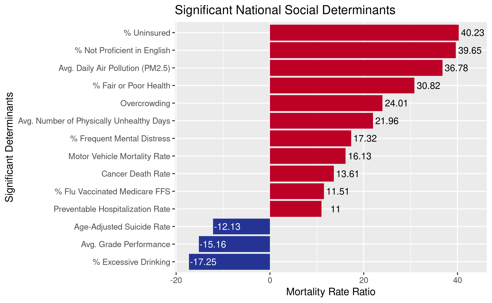
# 
# library(ggplot2)
# 
# #data from GWAS_ADJ_P and GWAS_MRR
# GWAS_ADJ_P
# #remove rows 1-14 
# GWAS_ADJ_P_interested <- GWAS_ADJ_P[-c(1:14), ]
# #GWAS_ADJ_P_t<-t(GWAS_ADJ_P_interested)
# #convert to data frame
# GWAS_ADJ_P_t <- as.data.frame(t(GWAS_ADJ_P_interested))
# #find significant determinants and create data frame with them
# GWAS_ADJ_P_signficant <- subset(GWAS_ADJ_P_t,  Interested_Variable < 0.05)
# #GWAS_ADJ_P_signficant <- subset(GWAS_ADJ_P_signficant,  Interested_Variable > 0)
# #rownames(GWAS_ADJ_P_t)
# 
# GWAS_MRR
# #remove rows 1-14
# GWAS_MRR_interested <- GWAS_MRR[-c(1:14), ]
# #convert to data frame
# GWAS_MRR_t <- as.data.frame(t(GWAS_MRR_interested))
# 
# #merge GWAS_ADJ and GWAS_MRR data
# GWAS_data <- merge(GWAS_ADJ_P_signficant, GWAS_MRR_t, by = 0) 
# #mutliply GWAS_MRR data by 100
# GWAS_data$MRRX100 <- GWAS_data$Interested_Variable.y * 100 
# 
# #convert MRRX100 as numeric and Row.names as characters
# GWAS_data$MRRX100 <- as.numeric(as.character(GWAS_data$MRRX100))
# GWAS_data
# GWAS_data$Row.names <- as.character(GWAS_data$Row.names)
# 
# #orders data from highest to lowest value
# GWAS_data$Row.names <- factor(GWAS_data$Row.names, levels = GWAS_data$Row.names[order(GWAS_data$MRRX100)])
# 
# #round MRRX100 to 2 decimal places for better viewing
# MRRX100 <- GWAS_data$MRRX100
# MRRX100_num<-round(MRRX100,digits=2)
# GWAS_data$MRRX100_round = MRRX100_num
# 
# # ggplot(GWAS_data, aes(x=Row.names, y=MRRX100)) +
# #   geom_bar(stat="identity",aes(fill=MRRX100<0))
# 
# #copy and make values N/A
# 
# #current work in process
# MRRX100_round <- GWAS_data$MRRX100_round
# MRRX100_pos <- subset(GWAS_data,  MRRX100_round > 0)
# #GWAS_data <- merge(GWAS_data, MRRX100_pos, by = "Row.names", all = TRUE)
# MRRX100_neg <- subset(GWAS_data,  MRRX100_round < 0)
# #GWAS_data <- merge(GWAS_data, MRRX100_neg, by = "Row.names", all = TRUE)
# 
# #plot
# ggplot(GWAS_data, aes(x=Row.names, y=MRRX100)) +
#    ggtitle("Significant National Social Determinants")+
#    xlab("Significant Determinants") +
#    ylab("Mortality Rate Ratio") +
#    geom_bar(stat = "identity",aes(fill=MRRX100<0)) +
#    coord_flip()+
#    theme(legend.position='none')+
#    scale_fill_manual(values = c("#bd0026", "#253494"))+
#    geom_text(aes(label=MRRX100_round), vjust=0.5,color="black", size=3.5, nudge_y = 2.75)
# 
# # ggplot(GWAS_data, aes(x=Row.names, y=MRRX100)) +
# #   ggtitle("Significant National Social Determinants")+
# #   xlab("Significant Determinants") +
# #   ylab("Mortality Rate Ratio") +
# #   geom_bar(stat = "identity",aes(fill=MRRX100<0)) +
# #   coord_flip()+
# #   theme(legend.position='none')+
# #   scale_fill_manual(values = c("#bd0026", "#253494"))+
# #   geom_text(aes(label=MRRX100_round, colour =MRRX100 <0), vjust=0.5, size=3.5, nudge_y = 2.5)
# 
# #change to black and white
# 
# ggsave("national_sd.png")

```

From ahns3-State_GWAS_Working_Determinants_Graphing.Rmd

* made a visualization for Dr. Bennett's presentation of the national significant coefficients and determinants from the research paper the COVIDMINDER team wrote
* CODE: national determinants
```{r}
library(ggplot2)

#create data frame with information from Table 2 of the paper
#Social_Determinants = siginificant national determinants
#Mortality_Rate_Ratio = % increase in COVID-19 mortality rate per standard deviation increase of coefficient
national.determinants <- data.frame(Social_Determinants  = c("Days Since First Infection", "% with Lung Cancer","% African American","Days Since Mask Required","Median Household Income","% Hispanic in County", "% Native American", "% with less than High-School Education" , "% Asian", "% Adult Asthma","% Uninsured","% Not Proficient in English", "Average Daily PM 2.5", "% Fair or Poor Health", "% Overcrowded Housing", "Average Number of Physically Unhealthy Days","% Frequently Mentally Distressed","Motor Vehicle Mortality Rate", "Cancer Death Rate","% Vaccinated for Influenza (Medicare FFS users)","Preventable Hospitalization Rate","Age-Adjusted Suicide Rate","Average Grade Performance","% Excessive Drinking"),
                                       Mortality_Rate_Ratio = c("124.94","40.87","36.11","30.41","22.00","21.53","16.34","14.13","8.31","-20.06","33.81","33.40","31.32","26.87","21.52","19.85","15.97","14.95","12.76","10.90","10.44","-12.93","-16.45","-18.93"))

#changes column Mortality_Rate_Ratio from character to numeric
national.determinants$Mortality_Rate_Ratio <- as.numeric(as.character(national.determinants$Mortality_Rate_Ratio))

#graph that does not order them in increasing order
#ggplot(national.determinants, aes(x=Social_Determinants, y=Mortality_Rate_Ratio)) + 
#  ggtitle("Significant National Social Determinants")+
#  xlab("Significant Determinants") +
#  ylab("Mortality Rate Ratio") +
#  geom_bar(stat = "identity")+ 
#  coord_flip()

#changes the order in which Social_Determinants appear
#highest to lowest value
national.determinants$Social_Determinants <- factor(national.determinants$Social_Determinants, levels = national.determinants$Social_Determinants[order(national.determinants$Mortality_Rate_Ratio)])

#graph of national determinants
#red = destructive determinant
#blue = protective determinant
ggplot(national.determinants, aes(x=Social_Determinants, y=Mortality_Rate_Ratio)) + 
  ggtitle("Significant National Social Determinants")+
  xlab("Significant Determinants") +
  ylab("Mortality Rate Ratio") +
  geom_bar(stat = "identity",aes(fill = Mortality_Rate_Ratio<0)) + 
  coord_flip() +
  geom_text(aes(label=Mortality_Rate_Ratio), vjust=0.5,color="black", size=3.5) +
  theme(legend.position='none') +
  scale_fill_manual(values = c("#bd0026", "#253494")) 
 
#scale_color_manual(values = c("#c35442", "#2b517f"))

ggsave("determinants_coefficients.png")
```

* CODE: national coefficients
```{r}
library(ggplot2)

#create data frame with information from Table 1 of the paper
#Coefficientsdf = siginificant national coefficients from a high-risk control model
#Mortality_Rate_Ratio = % increase in COVID-19 mortality rate per standard deviation increase of coefficient
national.coefficients <- data.frame(Coefficientsdf  = c("Days Since First Infection", "% with Lung Cancer","% African American","Days Since Mask Required","Median Household Income","% Hispanic in County", "% Native American", "% with less than High-School Education" , "% Asian", "% Adult Asthma"),
                                       Mortality_Rate_Ratio = c("124.94","40.87","36.11","30.41","22.00","21.53","16.34","14.13","8.31","-20.06")) 

#changes column Mortality_Rate_Ratio from character to numeric
national.coefficients$Mortality_Rate_Ratio <- as.numeric(as.character(national.coefficients$Mortality_Rate_Ratio))

#changes the order in which Coefficientsdf appear
#highest to lowest value
national.coefficients$Coefficientsdf <- factor(national.coefficients$Coefficientsdf, levels = national.coefficients$Coefficientsdf[order(national.coefficients$Mortality_Rate_Ratio)])

#graph of national coefficients
#red = destructive determinant
#blue = protective determinant
ggplot(national.coefficients, aes(x=Coefficientsdf , y=Mortality_Rate_Ratio)) + 
  ggtitle("Significant National Coefficients")+
  xlab("Significant Coefficients") +
  ylab("Mortality Rate Ratio") +
  geom_bar(stat = "identity",aes(fill = Mortality_Rate_Ratio<0)) + 
  coord_flip() +
  geom_text(aes(label=Mortality_Rate_Ratio), vjust=0.5,color="black", size=3.5) +
  theme(legend.position='none') +
  scale_fill_manual(values = c("#bd0026", "#253494")) 

ggsave("national_coefficients.png")
```

* made a stacked bar graph of top 12 state determinants 

* CODE: top 12 state social determinants
```{r}
#all made into comments because chunk will not knit but end result is this
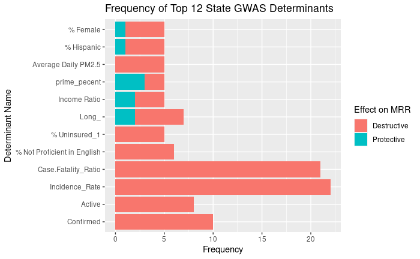

#library(ggplot2)

#Format
#Determinant Name
#line 1: determinant."name" created by subsetting the prtdescombined data frame witht the determinant name
#line 2: count."name" created by counting a p-value
#line 3: determinant."name" updated by combinding the older version of determinant."name" and count."name"

#states with not enough data: UT,VT,DE,ME,MD,MA,NH,NJ
#prtdescombined = rbind(dataAL , dataAR,dataAZ,dataCA, dataCO, dataFL, dataGA, dataIA, dataID,dataIL,dataIN,dataKS, dataKY, dataLA, dataMI, dataMN, dataMO, dataMS, dataMT, dataNC, dataND, dataNE, dataNJ, dataNM, dataNY, dataOH,dataOK,dataOR,dataPA,dataSC,dataSD, dataTN,dataTX,dataVA,dataWA,dataWI,dataWV)

#Incidence Rate
#determinant.incidencerate = subset(prtdescombined, y == "Incidence_Rate")
#count.incidencerate<- count(determinant.incidencerate$x, "2.74199053")
#determinant.incidencerate<- cbind(determinant.incidencerate, count.incidencerate[,2, drop=FALSE])

#Case Fatality Ratio
#determinant.case.fatality = subset(prtdescombined, y == "Case.Fatality_Ratio")
#count.case.fatality<- count(determinant.case.fatality$x, "2.239948")
#determinant.case.fatality<- cbind(determinant.case.fatality, count.case.fatality[,2, drop=FALSE])

#Confirmed
#determinant.confirmed = subset(prtdescombined, y == "Confirmed")
#count.confirmed<- count(determinant.confirmed$x, "1.820609")
#determinant.confirmed<- cbind(determinant.confirmed, count.confirmed[,2, drop=FALSE])

#Active
#determinant.active = subset(prtdescombined, y == "Active")
#count.active<- count(determinant.active$x, "1.790520")
#determinant.active<- cbind(determinant.active, count.active[,2, drop=FALSE])

#Longitude
#determinant.long = subset(prtdescombined, y == "Long_")
#count.long<- count(determinant.long$x, "0.39590409")
#determinant.long<- cbind(determinant.long, count.long[,2, drop=FALSE])

#% Not Proficient in English
#determinant.notproficientinenglish = subset(prtdescombined, y == "% Not Proficient in English")
#count.notproficientinenglish<- count(determinant.notproficientinenglish$x, "2.3443178")
#determinant.notproficientinenglish<- cbind(determinant.notproficientinenglish, count.notproficientinenglish[,2, drop=FALSE])

#% Uninsured 1
#determinant.uninsured_1 = subset(prtdescombined, y == "% Uninsured_1")
#count.uninsured_1<- count(determinant.uninsured_1$x, "1.54717163")
#determinant.uninsured_1<- cbind(determinant.uninsured_1, count.uninsured_1[,2, drop=FALSE])

#Income Ratio
#determinant.incomeratio = subset(prtdescombined, y == "Income Ratio")
#count.incomeratio<- count(determinant.incomeratio$x, "0.01679635")
#determinant.incomeratio<- cbind(determinant.incomeratio, count.incomeratio[,2, drop=FALSE])

#% Female
#determinant.female = subset(prtdescombined, y == "% Female")
#count.female<- count(determinant.female$x, "2.0518989")
#determinant.female<- cbind(determinant.female, count.female[,2, drop=FALSE])

#% Hispanic
#determinant.hispanic = subset(prtdescombined, y == "% Hispanic")
#count.hispanic<- count(determinant.hispanic$x, "1.667689")
#determinant.hispanic<- cbind(determinant.hispanic, count.hispanic[,2, drop=FALSE])

#Average Daily PM2.5
#determinant.averagedaily_pm2.5 = subset(prtdescombined, y == "Average Daily PM2.5")
#count.averagedaily_pm2.5<- count(determinant.averagedaily_pm2.5$x, "3.03507631")
#determinant.averagedaily_pm2.5<- cbind(determinant.averagedaily_pm2.5, count.averagedaily_pm2.5[,2, drop=FALSE])

#Prime_Pecent
#determinant.prime_pecent = subset(prtdescombined, y == "prime_pecent")
#count.prime_pecent<- count(determinant.prime_pecent$x, "0.6426303")
#determinant.prime_pecent<- cbind(determinant.prime_pecent, count.prime_pecent[,2, drop=FALSE])

#data frame with combined determinants
#top10significant.determinants<-rbind(determinant.incidencerate,determinant.case.fatality,determinant.confirmed,determinant.active,determinant.long,determinant.notproficientinenglish,determinant.uninsured_1,determinant.incomeratio,determinant.female,determinant.hispanic,determinant.averagedaily_pm2.5,determinant.prime_pecent)


#plot of top 12 significant determinants
#ggplot(top10significant.determinants) +
#  geom_bar(aes(x = y, fill = `Effect on MRR`)) +
#  ggtitle("Frequency of Top 12 State GWAS Determinants") +
#  xlab("Determinant Name") +
#  ylab("Frequency") +
#  coord_flip()
```


From ahns3-covid_vs_variable.Rmd

* looked at the correlation between COVID-19 mortality rate and despair rate
* CODE: covid vs despair
```{r}
#all made into comments because chunk will not knit but end result is this
knitr::include_graphics("ahns3-GraphingNotebooks/ahns3-facet_despair_withoutlog.png")
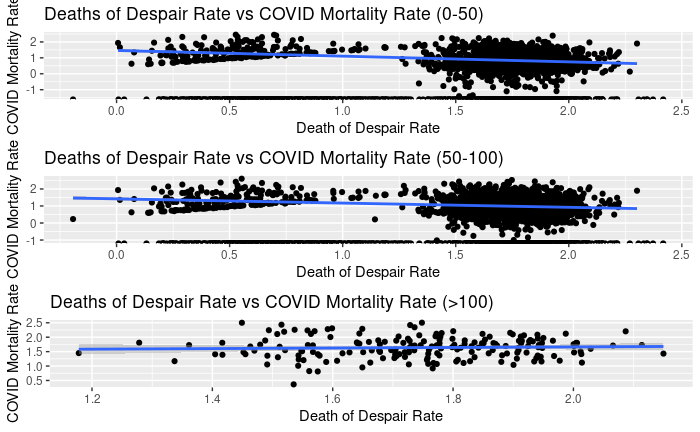

# library(gridExtra)
# library(ggplot2)
# library(dplyr)
# 
# #FORMAT:
# #>50 covid deaths vs despair
# #data for despair death rate
# cdc.data
# 
# #create dataframe with only despair death rate
# despair.data <- cdc.data[ which(cdc.data$death_cause=='Despair'
# & cdc.data$period== '2015-2017'), ]
# 
# #data for covid death rate
# covid_TS_counties_long.cases
# coviddeathallcounties <- covid_TS_counties_long.cases[ which(covid_TS_counties_long.cases$deaths >= 50 ),]
# 
# #combine despair and covid data
# keeps.despair <- c("county_name","county_fips","death_rate")
# despair.data.updated = despair.data[keeps.despair]
# keeps.covid <- c("County","countyFIPS","p_deaths")
# covid.data.updated = coviddeathallcounties[keeps.covid]
# COVIDdespair.all = merge(despair.data.updated, covid.data.updated, by.x="county_fips", by.y="countyFIPS")
# COVIDdespair<- distinct(COVIDdespair.all,county_fips, .keep_all= TRUE)
# 
# #correlation test
# cor.test(COVIDdespair$death_rate,COVIDdespair$p_deaths)
# #-0.05098315 
# 
# #graph of covid death rate vs despair death rate
# ggplot(data=COVIDdespair, aes(x=death_rate, y=p_deaths)) + 
#   geom_point() + geom_smooth(method="lm",se= TRUE) +
#   ggtitle("Deaths of Despair Rate vs COVID Mortality Rate (>50)") +
#   xlab("Death of Despair Rate") +
#   ylab("COVID Mortality Rate")
# 
# #start of code that was used
# 
# #0-50 covid deaths vs despair 
# cdc.data
# despair.data <- cdc.data[ which(cdc.data$death_cause=='Despair'
# & cdc.data$period== '2015-2017'), ]
# 
# covid_TS_counties_long.cases
# coviddeathallcountiesunder50 <- covid_TS_counties_long.cases[ which(covid_TS_counties_long.cases$deaths <=50 ),]
# 
# keeps.despairunder50 <- c("county_name","county_fips","death_rate")
# despair.data.updated.under50 = despair.data[keeps.despairunder50]
# keeps.covid <- c("County","countyFIPS","p_deaths")
# covid.data.updated = coviddeathallcountiesunder50[keeps.covid]
# COVIDdespair.all.under50 = merge(despair.data.updated.under50, covid.data.updated, by.x="county_fips", by.y="countyFIPS")
# 
# COVIDdespairunder50<- distinct(COVIDdespair.all.under50,county_fips, .keep_all= TRUE)
# 
# cor.test(COVIDdespairunder50$death_rate,COVIDdespairunder50$p_deaths)
# 
# p1<-ggplot(data=COVIDdespairunder50, aes(x=death_rate, y=p_deaths)) + 
#   geom_point() + geom_smooth(method="lm",se= TRUE) +
#   ggtitle("Deaths of Despair Rate vs COVID Mortality Rate (0-50)") +
#   xlab("Death of Despair Rate") +
#   ylab("COVID Mortality Rate")
# 
# #log10 transformation of data
# log10.covid.0_50<-(log10(COVIDdespairunder50$p_deaths))
# log10.despair.0_50<- (log10(COVIDdespairunder50$death_rate))
# COVIDdespairunder50$log10covid= log10.covid.0_50
# COVIDdespairunder50$log10despair=log10.despair.0_50
# p1_5<-ggplot(data=COVIDdespairunder50, aes(x=log10despair, y=log10covid)) + 
#   geom_point() + geom_smooth(method="lm",se= TRUE) +
#   ggtitle("Deaths of Despair Rate vs COVID Mortality Rate (0-50)") +
#   xlab("Death of Despair Rate") +
#   ylab("COVID Mortality Rate")
# 
# #50-100 covid death vs despair
# cdc.data
# despair.data <- cdc.data[ which(cdc.data$death_cause=='Despair'
# & cdc.data$period== '2015-2017'), ]
# 
# covid_TS_counties_long.cases
# coviddeathallcounties50100 <- covid_TS_counties_long.cases[ which(covid_TS_counties_long.cases$deaths >=50|covid_TS_counties_long.cases$deaths <=100 ),]
# 
# keeps.despair50100 <- c("county_name","county_fips","death_rate")
# despair.data.updated.50100 = despair.data[keeps.despair50100]
# keeps.covid <- c("County","countyFIPS","p_deaths")
# covid.data.updated50100 = coviddeathallcounties50100[keeps.covid]
# 
# COVIDdespair.all.50100 = merge(despair.data.updated.50100, covid.data.updated50100, by.x="county_fips", by.y="countyFIPS")
# 
# COVIDdespair50100<- distinct(COVIDdespair.all.50100,county_fips, .keep_all= TRUE)
# 
# cor.test(COVIDdespair50100$death_rate,COVIDdespair50100$p_deaths)
# 
# p2<-ggplot(data=COVIDdespair50100, aes(x=death_rate, y=p_deaths)) + 
#   geom_point() + geom_smooth(method="lm",se= TRUE) +
#   ggtitle("Deaths of Despair Rate vs COVID Mortality Rate (50-100)") +
#   xlab("Death of Despair Rate") +
#   ylab("COVID Mortality Rate")
# 
# #log10 transformation of data
# log10.covid.50_100<-(log10(COVIDdespair50100$p_deaths))
# log10.despair.50_100<- (log10(COVIDdespair50100$death_rate))
# COVIDdespair50100$log10covid= log10.covid.50_100
# COVIDdespair50100$log10despair=log10.despair.50_100
# p2_5<-ggplot(data=COVIDdespair50100, aes(x=log10despair, y=log10covid)) + 
#   geom_point() + geom_smooth(method="lm",se= TRUE) +
#   ggtitle("Deaths of Despair Rate vs COVID Mortality Rate (50-100)") +
#   xlab("Death of Despair Rate") +
#   ylab("COVID Mortality Rate")
# 
# #>100 covid death vs despair
# cdc.data
# despair.data <- cdc.data[ which(cdc.data$death_cause=='Despair'
# & cdc.data$period== '2015-2017'), ]
# 
# covid_TS_counties_long.cases
# coviddeathallcountiesgreater100 <- covid_TS_counties_long.cases[ which(covid_TS_counties_long.cases$deaths >=100 ),]
# 
# keeps.despairgreater100 <- c("county_name","county_fips","death_rate")
# despair.data.updated.greater100 = despair.data[keeps.despairgreater100]
# 
# keeps.covid <- c("County","countyFIPS","p_deaths")
# covid.data.updatedgreater100 = coviddeathallcountiesgreater100[keeps.covid]
# 
# COVIDdespair.all.greater100 = merge(despair.data.updated.greater100, covid.data.updatedgreater100, by.x="county_fips", by.y="countyFIPS")
# 
# COVIDdespairgreater100<- distinct(COVIDdespair.all.greater100,county_fips, .keep_all= TRUE)
# 
# cor.test(COVIDdespairgreater100$death_rate,COVIDdespairgreater100$p_deaths)
# 
# p3<-ggplot(data=COVIDdespairgreater100, aes(x=death_rate, y=p_deaths)) + 
#   geom_point() + geom_smooth(method="lm",se= TRUE) +
#   ggtitle("Deaths of Despair Rate vs COVID Mortality Rate (>100)") +
#   xlab("Death of Despair Rate") +
#   ylab("COVID Mortality Rate")
# 
# #log10 transformation of data
# log10.covid.greater100<-(log10(COVIDdespairgreater100$p_deaths))
# log10.despair.greater100<- (log10(COVIDdespairgreater100$death_rate))
# COVIDdespairgreater100$log10covid= log10.covid.greater100
# COVIDdespairgreater100$log10despair=log10.despair.greater100
# p3_5<-ggplot(data=COVIDdespairgreater100, aes(x=log10despair, y=log10covid)) + 
#   geom_point() + geom_smooth(method="lm",se= TRUE) +
#   ggtitle("Deaths of Despair Rate vs COVID Mortality Rate (>100)") +
#   xlab("Death of Despair Rate") +
#   ylab("COVID Mortality Rate")
# 
# #facet grids
# grid.arrange(p1, p2, p3, nrow = 3)
# grid.arrange(p1_5,p2_5,p3_5, nrow =3)
```


* looked at the correlation between COVID-19 mortality rate and suicide rate
* CODE: covid vs suicide
```{r}
#all made into comments because chunk will not knit but end result is this
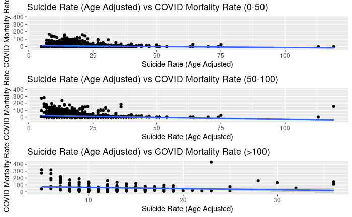
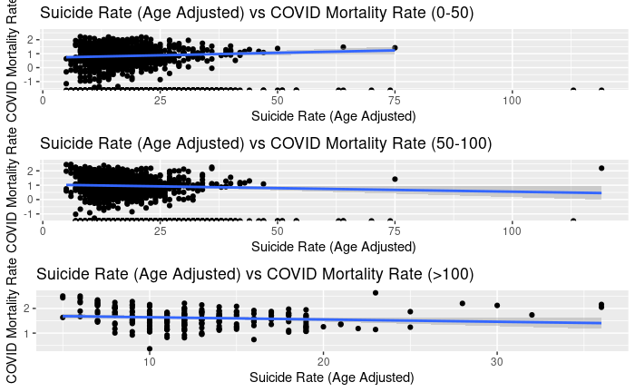

# library(tidyverse)
# library(dplyr)
# library(ggplot2)
# 
# #0-50 covid death vs suicide rate
# #data for suicide rate
# aaa<-read.csv("2020CHR.csv")
# data.suicide <- aaa %>% dplyr::select(FIPS, State, County, Suicide.Rate..Age.Adjusted.)
# 
# #data for covid death rate from counties with 0-50 deaths
# covid_TS_counties_long.cases<- read.csv("covid_TS_counties_long.cases.csv")
# coviddeathallcountiesunder50 <- covid_TS_counties_long.cases[ which(covid_TS_counties_long.cases$deaths <= 50 ),]
# 
# #combine data frames
# keeps.covid <- c("County","countyFIPS","p_deaths")
# covid.data.updatedunder50 = coviddeathallcountiesunder50[keeps.covid]
# COVIDsuicide.all.under50 = merge(data.suicide, covid.data.updatedunder50, by.x="FIPS", by.y="countyFIPS")
# COVIDsuicide.under50<- distinct(COVIDsuicide.all.under50,FIPS, .keep_all= TRUE)
# 
# #correlation test
# cor.test(COVIDsuicide.under50$Suicide.Rate..Age.Adjusted.,COVIDsuicide.under50$p_deaths)
# 
# #plot
# g1<-ggplot(data=COVIDsuicide.under50, aes(x=Suicide.Rate..Age.Adjusted., y=p_deaths)) + 
#   geom_point() + geom_smooth(method="lm",se= TRUE) +
#   ggtitle("Suicide Rate (Age Adjusted) vs COVID Mortality Rate (0-50)") +
#   xlab("Suicide Rate (Age Adjusted)") +
#   ylab("COVID Mortality Rate")
# 
# #log10 transformation and plot
# log10.covid.under50<-(log10(COVIDsuicide.under50$p_deaths))
# COVIDsuicide.under50$log10covid= log10.covid.under50
# g1_5<-ggplot(data=COVIDsuicide.under50, aes(x=Suicide.Rate..Age.Adjusted., y=log10covid)) + 
#   geom_point() + geom_smooth(method="lm",se= TRUE) +
#   ggtitle("Suicide Rate (Age Adjusted) vs COVID Mortality Rate (0-50)") +
#   xlab("Suicide Rate (Age Adjusted)") +
#   ylab("COVID Mortality Rate")
# 
# #50-100 covid death vs suicide rate
# aaa<-read.csv("2020CHR.csv")
# data.suicide <- aaa %>% dplyr::select(FIPS, State, County, Suicide.Rate..Age.Adjusted.)
# 
# #data for covid death rate from counties with 50-100 deaths
# covid_TS_counties_long.cases<- read.csv("covid_TS_counties_long.cases.csv")
# coviddeathallcounties50_100 <- covid_TS_counties_long.cases[ which(covid_TS_counties_long.cases$deaths >= 50|covid_TS_counties_long.cases$deaths <= 100 ),]
# 
# keeps.covid <- c("County","countyFIPS","p_deaths")
# covid.data.updated50_100 = coviddeathallcounties50_100[keeps.covid]
# COVIDsuicide.all.50_100 = merge(data.suicide, covid.data.updated50_100, by.x="FIPS", by.y="countyFIPS")
# COVIDsuicide.50_100<- distinct(COVIDsuicide.all.50_100,FIPS, .keep_all= TRUE)
# 
# cor.test(COVIDsuicide.50_100$Suicide.Rate..Age.Adjusted.,COVIDsuicide.50_100$p_deaths)
# 
# g2<-ggplot(data=COVIDsuicide.50_100, aes(x=Suicide.Rate..Age.Adjusted., y=p_deaths)) + 
#   geom_point() + geom_smooth(method="lm",se= TRUE) +
#   ggtitle("Suicide Rate (Age Adjusted) vs COVID Mortality Rate (50-100)") +
#   xlab("Suicide Rate (Age Adjusted)") +
#   ylab("COVID Mortality Rate")
# 
# log10.covid.50_100<-(log10(COVIDsuicide.50_100$p_deaths))
# COVIDsuicide.50_100$log10covid= log10.covid.50_100
# g2_5<-ggplot(data=COVIDsuicide.50_100, aes(x=Suicide.Rate..Age.Adjusted., y=log10covid)) + 
#   geom_point() + geom_smooth(method="lm",se= TRUE) +
#   ggtitle("Suicide Rate (Age Adjusted) vs COVID Mortality Rate (50-100)") +
#   xlab("Suicide Rate (Age Adjusted)") +
#   ylab("COVID Mortality Rate")
# 
# #>100 covid deaths vs suicide rate
# aaa<-read.csv("2020CHR.csv")
# data.suicide <- aaa %>% dplyr::select(FIPS, State, County, Suicide.Rate..Age.Adjusted.)
# 
# #data for covid death rate from counties with >100 deaths
# covid_TS_counties_long.cases<- read.csv("covid_TS_counties_long.cases.csv")
# coviddeathallcountiesgreater100 <- covid_TS_counties_long.cases[ which(covid_TS_counties_long.cases$deaths >= 100 ),]
# 
# keeps.covid <- c("County","countyFIPS","p_deaths")
# covid.data.updatedgreater100 = coviddeathallcountiesgreater100[keeps.covid]
# COVIDsuicide.all.greater100 = merge(data.suicide, covid.data.updatedgreater100, by.x="FIPS", by.y="countyFIPS")
# COVIDsuicide.greater100<- distinct(COVIDsuicide.all.greater100,FIPS, .keep_all= TRUE)
# 
# cor.test(COVIDsuicide.greater100$Suicide.Rate..Age.Adjusted.,COVIDsuicide.greater100$p_deaths)
# 
# g3<-ggplot(data=COVIDsuicide.greater100, aes(x=Suicide.Rate..Age.Adjusted., y=p_deaths)) + 
#   geom_point() + geom_smooth(method="lm",se= TRUE) +
#   ggtitle("Suicide Rate (Age Adjusted) vs COVID Mortality Rate (>100)") +
#   xlab("Suicide Rate (Age Adjusted)") +
#   ylab("COVID Mortality Rate")
# 
# log10.covid.greater100<-(log10(COVIDsuicide.greater100$p_deaths))
# COVIDsuicide.greater100$log10covid= log10.covid.greater100
# g3_5<-ggplot(data=COVIDsuicide.greater100, aes(x=Suicide.Rate..Age.Adjusted., y=log10covid)) + 
#   geom_point() + geom_smooth(method="lm",se= TRUE) +
#   ggtitle("Suicide Rate (Age Adjusted) vs COVID Mortality Rate (>100)") +
#   xlab("Suicide Rate (Age Adjusted)") +
#   ylab("COVID Mortality Rate")
# 
#facet grid
# grid.arrange(g1, g2, g3, nrow = 3)
# grid.arrange(g1_5,g2_5,g3_5, nrow=3)
```


* looked at correlation between COVID-19 mortality rate and excessive drinking rate
* CODE: covid vs excessive drinking
```{r}
#all made into comments because chunk will not knit but end result is this
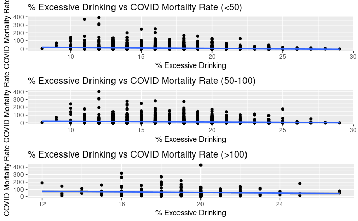
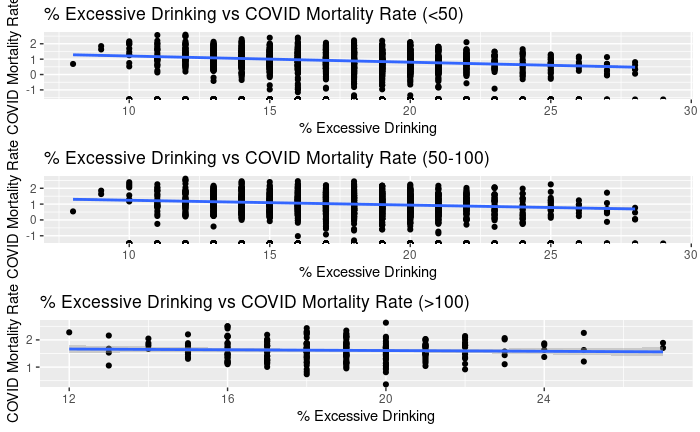

# library(tidyverse)
# library(dplyr)
# library(ggplot2)
# 
# #0-50 covid death vs excessive drinking
# #data for excessive drinking
# aaa<-read.csv("2020CHR.csv")
# data.excessdrink <- aaa %>% dplyr::select(FIPS, State, County,X..Excessive.Drinking)
# 
# #data for covid death rate from counties with 0-50 deaths
# covid_TS_counties_long.cases<- read.csv("covid_TS_counties_long.cases.csv")
# coviddeathallcounties <- covid_TS_counties_long.cases[ which(covid_TS_counties_long.cases$deaths <= 50 ),]
# 
# #combine data frames
# keeps.covid <- c("County","countyFIPS","p_deaths")
# covid.data.updated = coviddeathallcounties[keeps.covid]
# COVIDexcessdrink.all = merge(data.excessdrink, covid.data.updated, by.x="FIPS", by.y="countyFIPS")
# COVIDexcessdrink<- distinct(COVIDexcessdrink.all,FIPS, .keep_all= TRUE)
# 
# #correlation test
# cor.test(COVIDexcessdrink$X..Excessive.Drinking,COVIDexcessdrink$p_deaths)
# 
# #plot
# gg1<-ggplot(data=COVIDexcessdrink, aes(x=X..Excessive.Drinking, y=p_deaths)) + 
#   geom_point() + geom_smooth(method="lm",se= TRUE) +
#   ggtitle("% Excessive Drinking vs COVID Mortality Rate (<50)") +
#   xlab("% Excessive Drinking") +
#   ylab("COVID Mortality Rate")
# 
# #log10 transformation of data and plot
# log10.covid.greater100<-(log10(COVIDexcessdrink$p_deaths))
# COVIDexcessdrink$log10covid= log10.covid.greater100
# gg1_5<-ggplot(data=COVIDexcessdrink, aes(x=X..Excessive.Drinking, y=log10covid)) + 
#   geom_point() + geom_smooth(method="lm",se= TRUE) +
#   ggtitle("% Excessive Drinking vs COVID Mortality Rate (<50)") +
#   xlab("% Excessive Drinking") +
#   ylab("COVID Mortality Rate")
# 
# #50-100 covid deaths vs excessive drinking
# aaa<-read.csv("2020CHR.csv")
# data.excessdrink <- aaa %>% dplyr::select(FIPS, State, County, X..Excessive.Drinking)
# 
# #data for covid death rate from counties with 50-100 deaths
# covid_TS_counties_long.cases<- read.csv("covid_TS_counties_long.cases.csv")
# coviddeathallcounties50_100 <- covid_TS_counties_long.cases[ which(covid_TS_counties_long.cases$deaths >= 50|covid_TS_counties_long.cases$deaths <= 100 ),]
# 
# keeps.covid <- c("County","countyFIPS","p_deaths")
# covid.data.updated50_100 = coviddeathallcounties50_100[keeps.covid]
# COVIDexcessdrink.all.50_100 = merge(data.excessdrink, covid.data.updated50_100, by.x="FIPS", by.y="countyFIPS")
# COVIDexcessdrink.50_100<- distinct(COVIDexcessdrink.all.50_100,FIPS, .keep_all= TRUE)
# 
# cor.test(COVIDexcessdrink.50_100$X..Excessive.Drinking,COVIDexcessdrink.50_100$p_deaths)
# 
# gg2<-ggplot(data=COVIDexcessdrink.50_100, aes(x=X..Excessive.Drinking, y=p_deaths)) + 
#   geom_point() + geom_smooth(method="lm",se= TRUE) +
#   ggtitle("% Excessive Drinking vs COVID Mortality Rate (50-100)") +
#   xlab("% Excessive Drinking") +
#   ylab("COVID Mortality Rate")
# 
# log10.covid.50_100<-(log10(COVIDexcessdrink.50_100$p_deaths))
# COVIDexcessdrink.50_100$log10covid= log10.covid.50_100
# gg2_5<-ggplot(data=COVIDexcessdrink.50_100, aes(x=X..Excessive.Drinking, y=log10covid)) + 
#   geom_point() + geom_smooth(method="lm",se= TRUE) +
#   ggtitle("% Excessive Drinking vs COVID Mortality Rate (50-100)") +
#   xlab("% Excessive Drinking") +
#   ylab("COVID Mortality Rate")
# 
# #>100 covid deaths vs excessive drinking
# aaa<-read.csv("2020CHR.csv")
# data.excessdrink <- aaa %>% dplyr::select(FIPS, State, County, X..Excessive.Drinking)
# 
# #data for covid death rate from counties with >100 deaths
# covid_TS_counties_long.cases<- read.csv("covid_TS_counties_long.cases.csv")
# coviddeathallcountiesgreater100 <- covid_TS_counties_long.cases[ which(covid_TS_counties_long.cases$deaths >= 100 ),]
# 
# keeps.covid <- c("County","countyFIPS","p_deaths")
# covid.data.updatedgreater100 = coviddeathallcountiesgreater100[keeps.covid]
# COVIDexcessdrink.all.greater100 = merge(data.excessdrink, covid.data.updatedgreater100, by.x="FIPS", by.y="countyFIPS")
# COVIDexcessdrink.greater100<- distinct(COVIDexcessdrink.all.greater100,FIPS, .keep_all= TRUE)
# 
# cor.test(COVIDexcessdrink.greater100$X..Excessive.Drinking,COVIDexcessdrink.greater100$p_deaths)
# 
# gg3<-ggplot(data=COVIDexcessdrink.greater100, aes(x=X..Excessive.Drinking, y=p_deaths)) + 
#   geom_point() + geom_smooth(method="lm",se= TRUE) +
#   ggtitle("% Excessive Drinking vs COVID Mortality Rate (>100)") +
#   xlab("% Excessive Drinking") +
#   ylab("COVID Mortality Rate")
# 
# log10.covid.greater100<-(log10(COVIDexcessdrink.greater100$p_deaths))
# COVIDexcessdrink.greater100$log10covid= log10.covid.greater100
# gg3_5<-ggplot(data=COVIDexcessdrink.greater100, aes(x=X..Excessive.Drinking, y=log10covid)) + 
#   geom_point() + geom_smooth(method="lm",se= TRUE) +
#   ggtitle("% Excessive Drinking vs COVID Mortality Rate (>100)") +
#   xlab("% Excessive Drinking") +
#   ylab("COVID Mortality Rate")
# 
#facet grid
# grid.arrange(gg1, gg2, gg3, nrow = 3)
# grid.arrange(gg1_5,gg2_5,gg3_5, nrow=3)
```

## Discussion of Primary Findings 	

The national determinants graph previously was made with a data frame that was made by manually inputting variables and its values. This is not time efficient and cannot be used for long time use as the data is changing. I wrote a new code that automatically finds the significant determinants and graphs them. This way, the graph can be updated without manually inputting values into the data frame. I am currently working on refining the code to produce a neater graph. 

```{r}

```

In addition to the live national graph, I created graphs for each individual state that can be updated automatically when the data is updated. Some states did not yield a graph because of a lack of data, and those states are noted. I am currently working on refining the code to produce a neater graph and to produce an image for the states that do not have a graph. 

```{r}

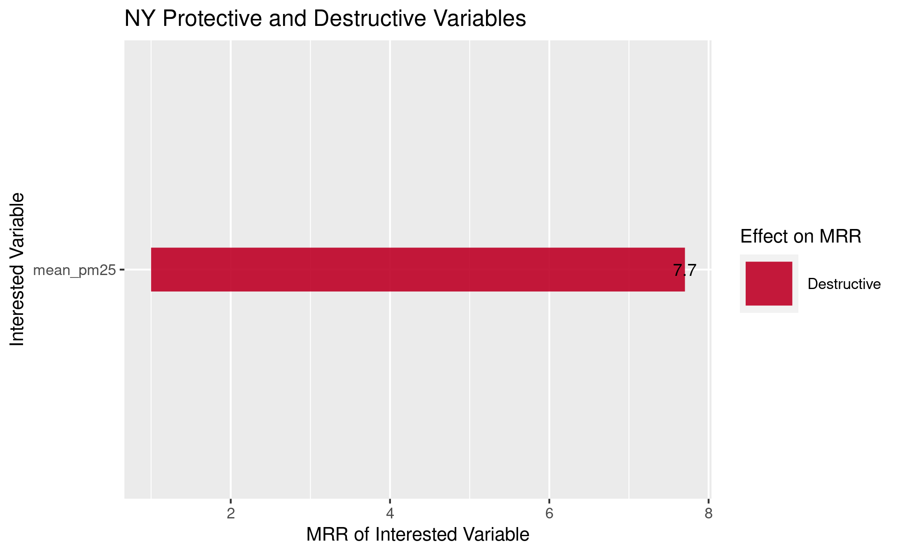
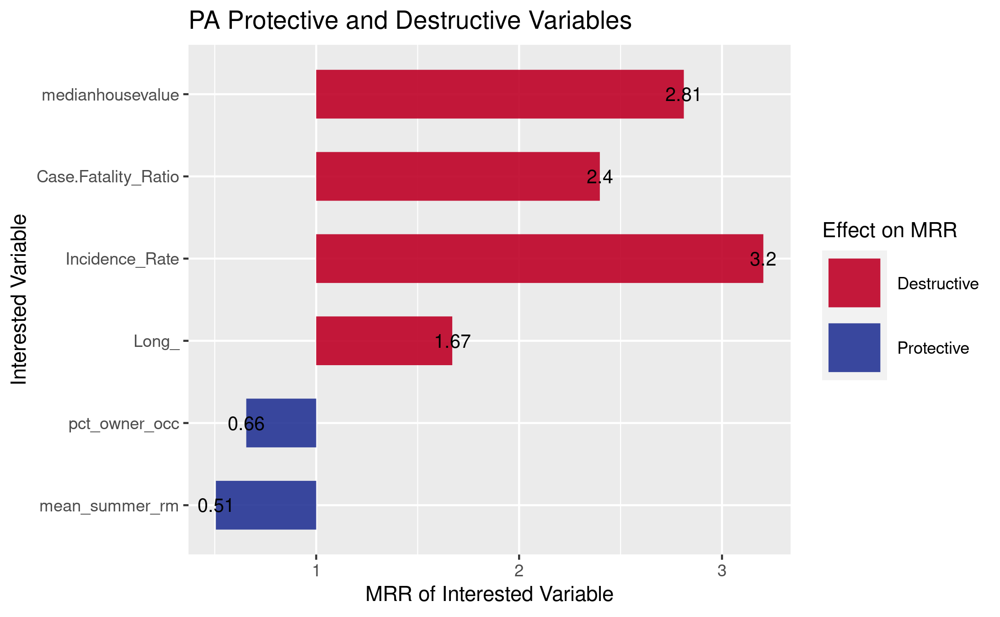
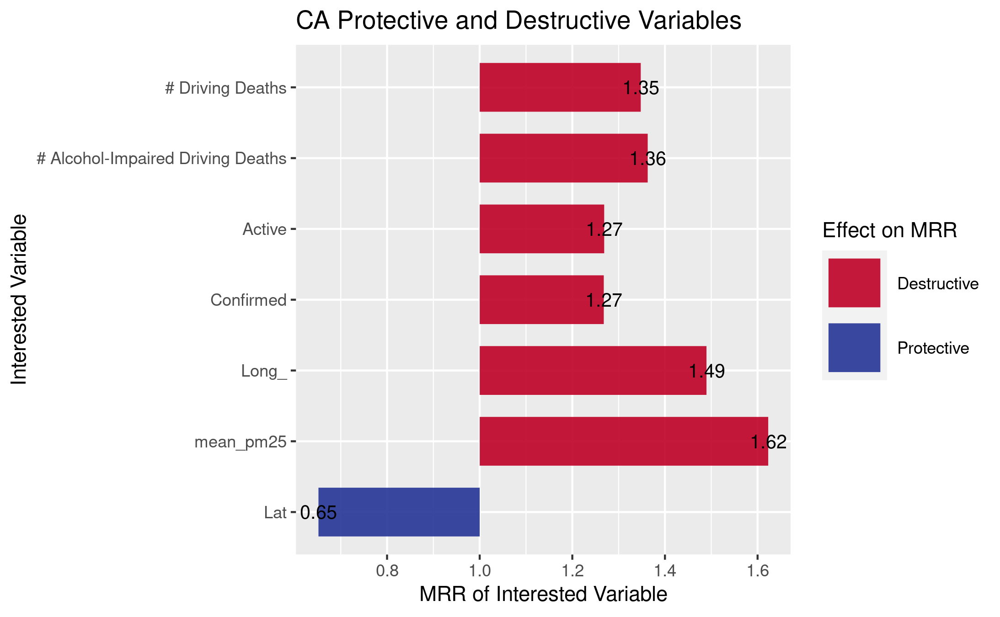
```

I looked at the correlation between COVID-19 mortality rate and different significant variables from the paper. In my case, I had deaths of despair, suicide, and excessive drinking. When I got weak negative correlations for all three variables, Dr. Bennett suggested to try facet grids where each graph will represent a different amount of deaths. Negative correlations mean that the variables help reduce COVID-19 mortality rate. The three groups are 0-50 deaths, 50-100 deaths, and greater than 100 deaths. When these also yielded weak negative correlations, she suggested to take the log10 of the data. In the case of despair death rate, the 0-50 and 50-100 groups did not yield a correlation. The greater than 100 group yielded a weak positive correlation, which means the variable when in places with more than 100 COVID-19 deaths does help increase COVID-19 mortality. This is the opposite of the untransformed data and what the overall trend shows. On the other hand, in the cases of suicide and excessive drinking, the log10 transformed did not change the weak negative trend for the greater than 100 group. The 0-50 and 50-100 groups for the two variables did not yield a correlation as well. 


```{r}
#plots of untransformed data of covid vs despair
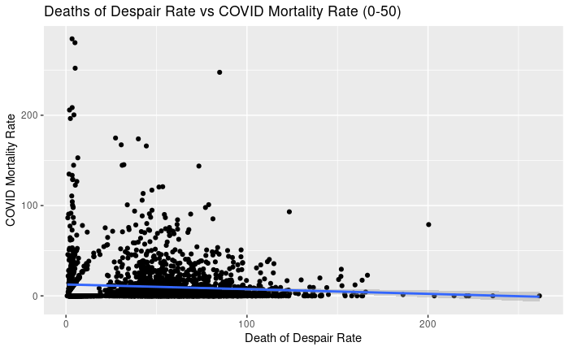
knitr::include_graphics("ahns3-GraphingNotebooks/p2.png")
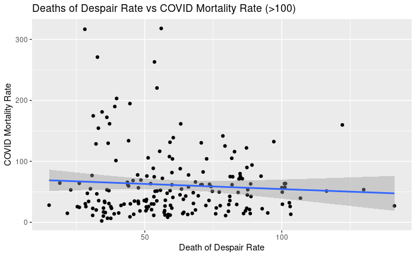

#plot of log10 transformed data of covid vs depair
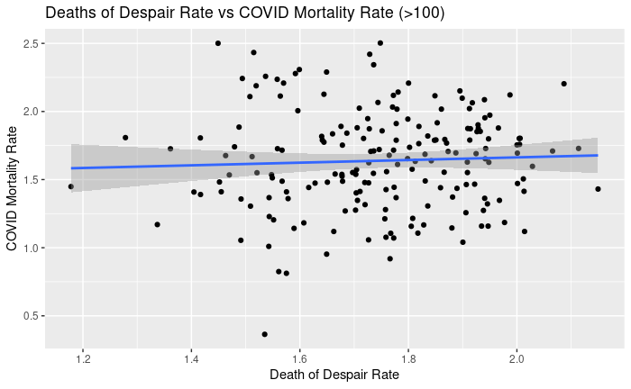

#plots of untransformed data of covid vs suicide
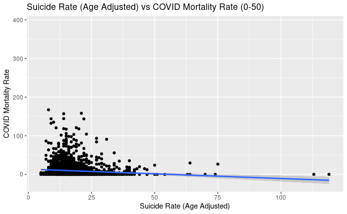
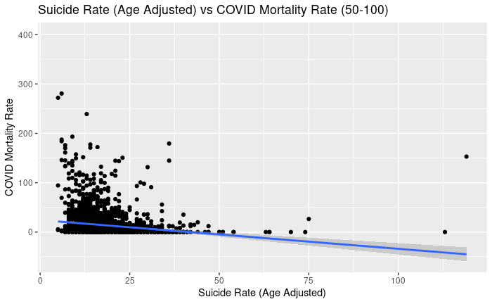
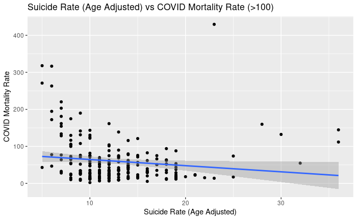

#plot of log10 transformed data of covid vs suicide
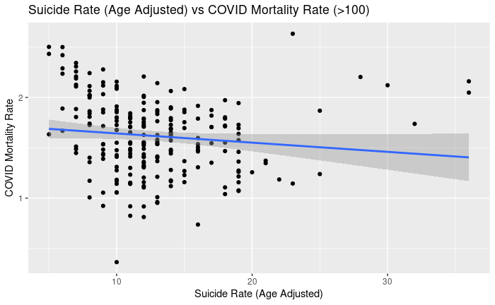

#plots of untransformed data of covid vs excessive drinking
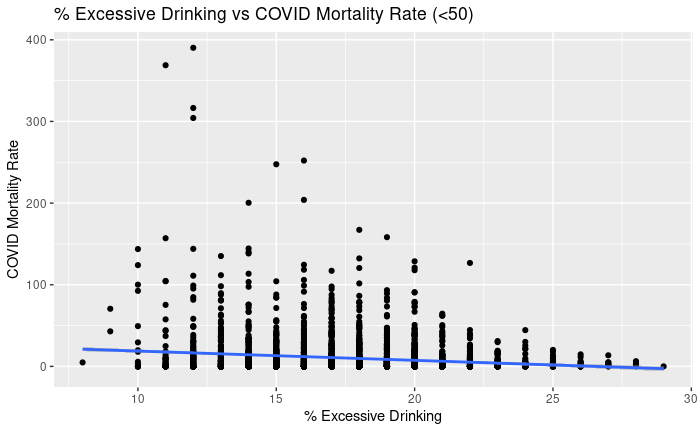
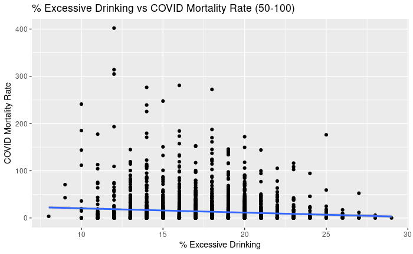
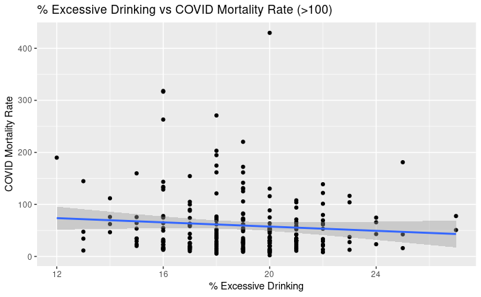

#plot of log10 transformed data of covid vs excessive drinking
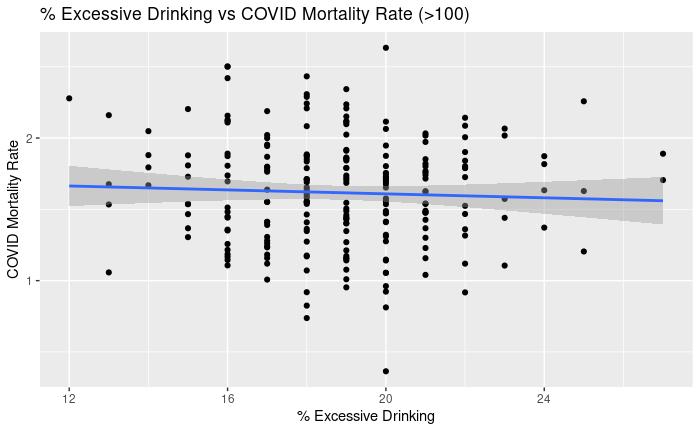
```


## Your Final DAR/HACL Blog Post
Student researchers of Rensselaer Polytechnic Institute during the months of July and August looked at the most occurring significant social determinants for all 50 states. The usage of a stacked bar graph allowed for the visualization of this data and to find the most significant social determinants whether it had a destructive or protective effect on COVID-19 mortality rate.
  
To start this process, researchers looked at significant determinants in each state and determined if the determinants are destructive or protective. If the determinant increases the COVID-19 mortality rate, it was labeled as destructive. If the determinant decreases the COVID-19 mortality rate, it was labeled as protective. States with a small number of counties, such as Delaware and Maryland, did not yield enough data for the determinants to be considered significant and protective and destructive towards COVID-19 mortality. 

After finding all the applicable states’ data, researchers counted the frequency of each determinant’s appearance and how often it appeared as either protective or destructive. To present data on all fifty states in the most effective manner, a stacked bar graph was utilized to represent this data. The following social determinants are the top twelve appearing determinants across all applicable states: incidence rate (22), case fatality ratio (21), confirmed (10), active (8), longitude (7), percent not proficient in English (6), percent uninsured (5), income ratio (5), percent female (5), percent Hispanic (5), average daily PM 2.5 (5), and prime percent (5). Out of the twelve, incidence rate and case fatality appeared the most, nearly half of the states, as significant destructive determinants. 
	
These are thoughts on why some of these determinants came to be significant and had protective or destructive effects on the COVID mortality rate ratio. Incidence rate is the rate of COVID-19 cases, and the more COVID-19 cases means that there will be more deaths. Therefore, all of significant occurrences came back as destructive as it does not help with the prevention of COVID deaths. Case fatality ratio and confirmed also are other determinants that appeared as destructive since the more deaths and cases there are, the more likely there is more COVID-19 related deaths. Longitude came out as a determinant with both protective and destructive effects. Arizona, California, Pennsylvania, South Carolina, Michigan, and Virginia yielded this determinant as destructive while Kentucky had it as protective. Researchers speculated that the spread of COVID-19 could be impacted by temperature. However, Kentucky and Virginia are in similar locations but gave different results. Longitude likely needs other determinants impacting the mortality rate to be significant. 

Overall, determinants that negatively affected a person’s quality of life were qualified as destructive. People who are not proficient in English has a destructive impact because those people cannot get critical, time-sensitive information quickly as compared to those who are proficient in English. The slower information flow will result in them less likely to get proper care and to more likely result in death. Also, people with no insurance are also more likely to die from COVID-19 because they are less likely to go to hospitals. The financial burden of a hospital bill prevents them from getting the care they need if they are infected. In addition, the average daily PM 2.5, air pollutant, negatively affects a person’s health, especially the respiratory system. Since COVID-19 is a respiratory disease, it makes sense that people who have weakened respiratory systems are more likely to die from COVID-19. 

In the United States, the presence of COVID-19 has negatively affected its population with over five million confirmed cases and a million deaths. Some people are more likely to die from COVID-19 and its resulting complications than others because of specific social determinants. Some negatively impact the prevention of COVID-19, increasing COVID-19 mortality, while others positively impact the prevention of COVID-19. Therefore, studying significant social determinants and taking them into account will help reduce the number of cases and the death rate in the United States. 
```{r}

```